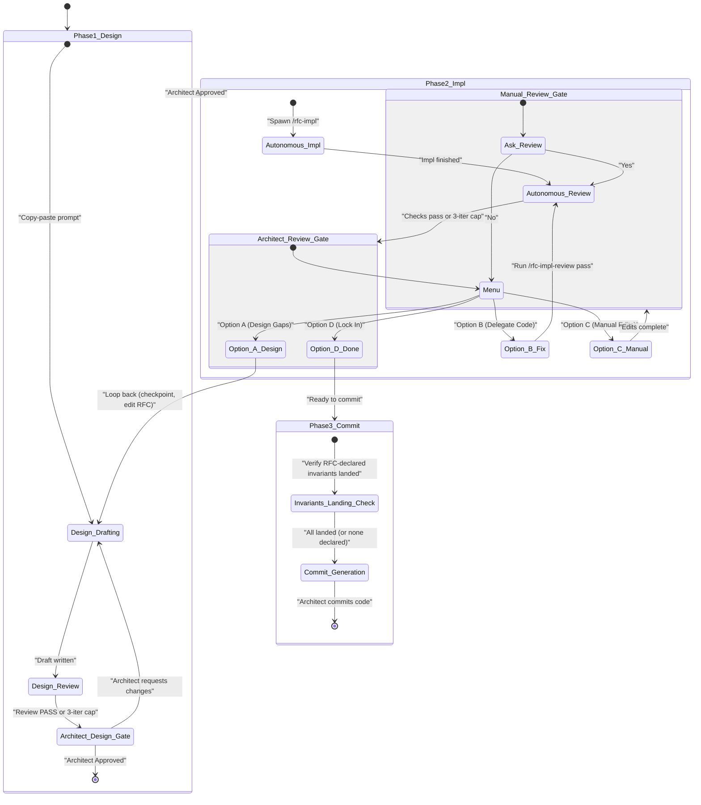

# RFC Pipeline Master Skill

This skill acts as the master orchestrator for the entire RFC-driven development
lifecycle. It manages the state machine, spawns background agents to run
autonomous loops, and guides the human Architect through interactive phases in
strict sequential order. All skill references in this master orchestrator are
prefixed with a slash (e.g., `/rfc-design`) to indicate they are executable
macro tools rather than plain phrases.

**Role — master.** This skill wears the **master** hat from `iterative-work`,
which defines the master / orchestrator / worker contracts and the universal
rules once: capture-on-completion, scratch ownership, checkpoint-at-gates,
verify-on-return-_and_-stall, bounded fan-out, write-scope enforcement,
never-trust-green. Below, this skill states only the **pipeline-specific
mechanics** (worktree, git checkpoints, phase sequencing, the invariants landing
check); where the two overlap, `iterative-work` is the contract and this file is
the instantiation.

## How work is dispatched in Claude Code

Three dispatch mechanisms, chosen by the phase's shape:

- **Single-shot autonomous work → background agents.** Work that runs once with
  no human interaction and does **not** drive `/skill-loop` — implementation
  (`/rfc-impl`), the Stage-A review prep (`[rfc-impl-review-prep]`), and fix
  passes (`/rfc-impl-fix`) — is spawned with the **`Agent` tool** using
  `run_in_background: true`. The harness re-invokes this orchestrator with the
  agent's final report when it finishes, so you can spawn, then continue once
  notified — no polling required.
- **Autonomous loops → an operator-launched separate conversation.** The review
  loop (`/rfc-review-loop`, Phase 1) drives `/skill-loop`, which runs its chain
  by spawning a background child per step and awaiting it. That
  resume-on-completion only works when the loop is the **top-level** session, so
  a loop **cannot** be run as a background agent from here: one level down it
  would strand — the harness marks the middle agent complete the instant it
  yields to wait, its background child reparents to the top level, and the
  child's completion never returns to the loop, which never resumes. So dispatch
  it the **same way as design**: hand the operator a copy-pasteable prompt to
  run the loop in a **new conversation** (a fresh top-level session), then pause
  and wait for them to return the loop's summary. No human _judgment_ is
  exercised here — the operator is only the launch vehicle for a top-level
  session; the loop itself is fully autonomous.
- **Interactive design → an operator-launched separate conversation.** Design
  needs live back-and-forth with the Architect, which a background agent cannot
  do. Same mechanism as the loops (copy-pasteable prompt, new conversation,
  pause and wait), but here the human genuinely participates.

The stated reason for pushing loop and design work into a separate conversation
is _"to keep my context window clean so I can stay focused on my job."_

Every dispatched unit — background agent or operator-launched conversation —
MUST operate inside this run's dedicated **pipeline worktree**
(`<codebase-root>`, created in Phase 0), never the directory this orchestrator
conversation runs in. For background agents, pass it as the codebase root and do
**not** pass the Agent tool's `isolation: "worktree"` — that creates an
_ephemeral_ worktree the harness auto-deletes; this pipeline uses a _persistent_
worktree on the `pipeline/rfc-<n>` branch instead. For operator-launched
conversations, the copy-pasteable prompt names `<codebase-root>` explicitly.
Running each pipeline in its own worktree is exactly what lets multiple RFC
pipelines proceed concurrently without colliding on a shared working tree.

Use `subagent_type: general-purpose` for all background agents (it has full tool
access and can invoke the sibling skills). Continue an existing background agent
with `SendMessage` if you need to hand it a follow-up without losing its
context; otherwise spawn a fresh agent per phase.

**Review-agent model policy.** This pipeline is heavyweight and its reviews are
adversarial, so **run it on a capable session model.** The review
_orchestrators_ — the Phase 1 `/rfc-review-loop` (RFC design review) and
**every** `/rfc-impl-review` / `/rfc-impl-review-loop` pass in Phase 2 — are
**not** pinned; they inherit that session model and so never go stale as models
change. The model pins in this pipeline are confined to **non-adversarial** work
where the mid tier is cheaper without costing correctness reasoning: the
**leaf** reviewers — the code-review and design-review chains fan out to many
small parallel agents, held to a mid tier via the `code-reviewer` and
`design-reviewer` agent definitions in `.claude/agents/`. Those `model:` pins
are the places to revisit if the model lineup ever reshuffles. The adversarial
review orchestrators above stay on the session model on purpose.

The shared review context — the base-to-HEAD diff plus each changed file's
contents — is materialized **once to `<scratch>/review-context.md`** (by the
`[rfc-impl-review-prep]` Stage A agent in Phase 2), and each leaf `Read`s that
file rather than receiving it inline. Use the per-lens fan-out as the
**default** for these reviews; the single-inline-agent mode (all lenses in one
pass) is an opt-in fast mode only, never the default for a real pipeline review.

## Critical Behaviours

- **Codebase Root Directory**: The orchestrator tracks the absolute path of this
  run's dedicated pipeline worktree as a required state parameter
  (`<codebase-root>`) and passes it explicitly to every interactive prompt and
  background-agent invocation. **`<codebase-root>` is the worktree created in
  Phase 0** (e.g. `../unicoach-rfc-<n>` resolved to an absolute path), NOT the
  directory this conversation runs in. The orchestrator's own shell stays in the
  original checkout, so every git command it runs MUST target the worktree —
  either `git -C "<codebase-root>" …` or by running from that directory.
- **Context Window Protection**: To prevent context bloat, the orchestrator MUST
  NOT run autonomous phases (review loops, implementation runs) inline in this
  conversation. Dispatch them per the mechanisms above — background agents for
  single-shot autonomous work, a copy-pasteable new-conversation prompt for
  autonomous loops and interactive design.
  - **Carve-out — the leaf review fan-out runs inline.** The one autonomous
    activity the orchestrator runs **inline** is the Phase 2
    implementation-review **leaf fan-out** (the `design-review-chain` /
    `code-review-chain`, Phase 2 step 2b below). This is required by the
    **Depth-1 Fan-out Invariant**: the leaves must be **depth-1** children of
    this top-level session to reap reliably, and a background-agent hop above
    the fan-out makes them grandchildren that the harness reaps unreliably. It
    is safe to own inline because its context cost is bounded to **lens names
    and scratch paths** — the per-leaf verdicts and the shared review context
    live in files, not this conversation. Everything context-heavy (scope
    reasoning, the changed-file reads, guard-branch service boots, the
    independent test run, and all fixes) stays delegated to background agents or
    is already accepted inline.

- **Depth-1 Fan-out Invariant**: A leaf-spawning review fan-out (the
  `design-review-chain` / `code-review-chain`, and `rfc-impl-review` Phase 3
  that drives them) MUST execute in the **top-level session** so each leaf is a
  **depth-1** child. It MUST NOT be invoked from inside a background subagent
  (an `Agent`-tool task), because that makes the leaves **grandchildren**, which
  the Claude Code harness task layer reaps unreliably (a finished leaf can stay
  `running` indefinitely — the defect RFC 75 works around). So the pipeline
  **never backgrounds a whole `rfc-impl-review`**: it delegates only the
  no-fan-out Stage A (`[rfc-impl-review-prep]`) and runs the leaf fan-out inline
  (Phase 2 step 2 below).
- **Transparency before spawning**: Immediately before spawning any background
  agent, print one line in the chat stream naming the agent and its task, e.g.
  `Spawning agent "[rfc-impl] rfc/<n> <rfc-name>": <one-line task summary>`.
  When you instruct a background agent that it may itself spawn nested agents,
  require it to list any nested agents it launched (name + task) in its final
  report, so you can surface them to the Architect. (Claude Code does not
  deliver live mid-run notifications from a background agent, so capture this in
  the agent's returned summary rather than expecting an interrupt.)

## Session Naming

Every session this pipeline creates — both the background agents it spawns and
the separate conversations it asks the Architect to open — is named with one
uniform convention so a run's sessions are identifiable at a glance and grouped
by RFC:

```
[<skill-name>] rfc/<n> <rfc-name>
```

- `<skill-name>` is the skill that session **runs**, without the leading slash.
  - This orchestrator's **own** session is `rfc-pipeline`.
  - The operator-launched separate conversations are `rfc-design` (interactive
    design) and `rfc-review-loop` (Phase 1 autonomous loop).
  - Each background agent uses the actual sub-skill it invokes (`rfc-impl`,
    `rfc-impl-review-loop`, `rfc-impl-fix`, `rfc-impl-review`). The Phase 2
    delegated Stage A prep agent — which runs `rfc-impl-review` Stage A only and
    spawns no leaves — is named `rfc-impl-review-prep`. The leaf fan-out (Phase
    2 step 2b) runs inline in **this** orchestrator session, so it spawns no
    separately-named session.
- `<n>` is this run's RFC number, claimed in Phase 0.
- `<rfc-name>` is a short, human-readable title for the RFC in Sentence case,
  derived from the RFC's H1 / brief description (e.g. `69-email-verification.md`
  → `Email verification`). **Record it in orchestrator state alongside `<n>`**
  and reuse the **same** string for every session in the run.

Examples: `[rfc-pipeline] rfc/69 Email verification`,
`[rfc-design] rfc/69 Email verification`,
`[rfc-impl] rfc/69 Email verification`.

How each session gets its name depends on who owns it:

- **This orchestrator session.** The harness auto-titles this conversation, and
  the model **cannot rename its own session** — only the `/rename` slash command
  can, and only the Architect can run it. So, as soon as both `<n>` and
  `<rfc-name>` are known (right after Phase 1 establishes `<rfc-name>`), **ask
  the Architect to run** `/rename [rfc-pipeline] rfc/<n> <rfc-name>` in this
  conversation. Treat it as best-effort cosmetics — if they skip it, continue
  the pipeline normally.
- **Background agents.** This string is the **`Agent` tool's `description`**
  field — the task/session name the harness surfaces. The orchestrator sets it
  directly; no human step.
- **Operator-launched child conversations** (the interactive design conversation
  and the `rfc-review-loop` autonomous-loop conversation). These too are
  sessions whose model cannot rename itself, so auto-titling will be wrong.
  Instruct the Architect to run `/rename [<skill-name>] rfc/<n> <rfc-name>` **as
  the first message** in the new conversation (or launch it with `claude -n`),
  before running the skill.

## Change Tracking, Checkpoints & Agent Write-Scope

The pipeline runs many subagents against this run's **dedicated worktree**
across many steps. To make every step's delta inspectable, every agent's writes
verifiable, and a stalled or rogue agent recoverable, the orchestrator tracks
all state on a **pipeline branch checked out in its own git worktree**, with
**checkpoint commits**, and verifies each agent's footprint against a declared
**write-scope allowlist**. Because each run has its own worktree and branch,
concurrent pipelines never contend for the working tree.

### Pipeline scripts (the git plumbing)

The git mechanics are owned by this skill's bundled `scripts/` directory, run
via `nix develop -c`. Below they are named **bare** (e.g.
`rfc-pipeline-checkpoint`); resolve each to `scripts/<name>` relative to this
skill. They target the worktree internally and track all SHAs in the run's
state + checkpoint ledger, so the orchestrator never hand-runs git or tracks
SHAs in its context. Run each with `-h` for its full contract.

| Script (all but `claim` take `-s <run-scratch>`)     | Owns                                                      |
| ---------------------------------------------------- | --------------------------------------------------------- |
| `rfc-pipeline-claim`                                 | Phase 0 claim; prints the run state on stdout             |
| `rfc-pipeline-checkpoint <step> [i]`                 | `--no-verify` WIP checkpoint + ledger row; prints the SHA |
| `rfc-pipeline-verify-scope [-d glob]… [allow-glob…]` | write-scope assertion (subset / deny / clean)             |
| `rfc-pipeline-recover [step [i] \| sha]`             | `reset --hard` to a checkpoint + `clean -fd`              |
| `rfc-pipeline-squash`                                | `reset --soft <base>` to collapse WIP history             |
| `rfc-pipeline-land`                                  | ff-merge, remove worktree, delete branch                  |

`--no-verify` lives in `rfc-pipeline-checkpoint` (fast WIP commits, and the flag
stays out of the classifier-inspected Bash string) and in **one** of the
Architect's two final commits: the **code** commit runs the full pre-commit hook
— its `bin/test check` is the run's final independent gate, and the same hook
run also covers ktlint, `deno fmt --check` over the whole working tree (RFC
markdown included), and the staged-spec fuzz — so the **RFC-doc** commit is made
with `--no-verify` rather than paying for a second, identical `bin/test check`
over a tree the hook already validated (see Phase 3b). Any bare `git …` below
means `git -C "<codebase-root>" …`.

### Phase 0 — pipeline worktree (before Phase 1)

**Claim the next free RFC number `<n>` by creating the worktree**, by running
`rfc-pipeline-claim` from the original checkout.

**Capture its stdout** (the run state: `RFC_NUM`, `CODEBASE_ROOT`, `BASE_SHA`,
`RUN_SCRATCH`, …) — it parameterizes the rest of the run. Set `<codebase-root>`
to `CODEBASE_ROOT`; all pipeline work happens there, never touching the default
branch or original checkout until Phase 3.

Why a script: a concurrent pipeline claims its number by creating the
`pipeline/rfc-<n>` branch+worktree **before** committing any RFC file, so `<n>`
must clear the max of committed `rfc/NN`, existing `pipeline/rfc-NN` branches,
**and** `…-rfc-NN` worktrees — and the claim must be atomic (create-then-retry
on race). Hand-run git gets this wrong.

`claim` also records the base SHA in the **state file** and scaffolds
`<run-scratch>` (`<codebase-root>/.scratch/rfc-<n>/`) with the layout below and
an empty checkpoint ledger. Checkpoints append their SHA to the ledger;
`recover`/`squash` resolve targets by **step name** — so you never track SHAs by
hand. Hand `<run-scratch>` plus the exact sub-path to **every** agent you spawn
(the master-owned capture layer from `iterative-work`: write-once,
skip-if-present, gitignored, survives recovery resets). Layout:

```
<run-scratch>/
  phase1/review-loop/iter-<i>/…
  phase2/impl/…
  phase2/impl-review/iter-<i>/review-context.md    # Stage A ([rfc-impl-review-prep]) builds it; leaves Read it
  phase2/impl-review/iter-<i>/prep.json            # Stage A scope/test findings handoff
  phase2/impl-review/iter-<i>/design/leaves/<lens>.json  # one file per design leaf, write-once on completion
  phase2/impl-review/iter-<i>/code/leaves/<lens>.json    # one file per code leaf, write-once on completion
  phase2/impl-review/iter-<i>/report.md            # compiled — reconstructable from leaves/
  phase2/impl-fix/iter-<i>/ledger.jsonl            # one line per finding: applied | skipped | failed
```

### Checkpoints

`rfc-pipeline-checkpoint -s <run-scratch> <step> [i]` snapshots the entire
worktree at a gate boundary. Policy:

- **Checkpoint at every gate boundary**: immediately before and after each
  subagent spawn, and before each Architect review. Never checkpoint while an
  agent is mid-write — the snapshot must be consistent.
- **Number every loopable step.** Any step the state machine can repeat —
  `review-loop`, `impl-review`, `impl-fix`, `architect-review` — carries a
  monotonic `[i]` counter. Counters are **monotonic per step-type across the
  whole run and never reused**: if the Architect loops back and re-runs reviews,
  they continue `[4] [5] …`, they do not reset. A number therefore identifies a
  unique moment. Non-loop steps omit the counter.

### Diffs for the Architect walkthrough

Resolve checkpoint SHAs from the ledger by step name (base SHA from state), then
plain git:

```sh
git -C "<codebase-root>" diff <prev-sha> <this-sha> -- rfc/<rfc-file>.md   # one step
git -C "<codebase-root>" diff <base-sha> HEAD                              # cumulative
```

Build walkthroughs and `.scratch/implementation_diff.md` from these (`.scratch/`
is gitignored, never committed).

### Recovery

`rfc-pipeline-recover -s <run-scratch> [step [i]]` resets to a checkpoint
(default: last) and `clean -fd`s, keeping `<run-scratch>` so a re-spawn resumes.
Per `iterative-work`, **verify before you trust or reset**: on every return
_and_ stall/kill, independently re-run the suite (a stalled agent may leave a
broken tree) — green + write-scope-clean ⇒ checkpoint and keep; else recover and
re-spawn against the same `<run-scratch>`, then escalate.

### Agent write-scope contract (enforced, not trusted)

Agent and operator-run-loop self-reports are not authoritative. The tree is at a
clean checkpoint before every dispatch (background spawn or operator-launched
loop), so on return its `git status` is the **exact** footprint. The
orchestrator asserts that footprint against the declared scope with
`rfc-pipeline-verify-scope` (exit 0 = within scope; exit 1 = violation with the
offending paths on stderr):

| Agent                              | May write (tracked)                  | `rfc-pipeline-verify-scope -s <run-scratch> …`     |
| ---------------------------------- | ------------------------------------ | -------------------------------------------------- |
| `/rfc-review-loop`                 | `rfc/<rfc-file>.md`                  | `'rfc/<rfc-file>.md'` (allowlist: subset enforced) |
| `[rfc-impl-review-prep]` (Stage A) | nothing                              | _(no globs: tree must be clean)_                   |
| `/rfc-impl`, `/rfc-impl-fix`       | code, tests, config, `INVARIANTS.md` | `-d '*/SPEC.md'` (SPEC.md Creation Ban)            |

`*/INVARIANTS.md` is **in scope** for `/rfc-impl` / `/rfc-impl-fix` only to land
invariants the RFC's **Invariants** section declares (they were human-reviewed
with the RFC — that is the human gate); an INVARIANTS.md edit with no matching
RFC declaration is a scope violation. `SPEC.md` files no longer exist in this
codebase; the deny glob stops an agent from reintroducing one.

The inline leaf fan-out (Phase 2 step 2b) writes only to `.scratch/`
(gitignored, never in `git status`), so it needs no row. A net-zero edit (modify
then revert) is invisible and acceptable. On any violation: surface it,
`rfc-pipeline-recover` to discard the rogue writes, then re-run or escalate —
never silently keep out-of-scope writes.

### Independent verification (never trust "green", but don't re-run needlessly)

Write-scope verifies _where_ an agent wrote, not whether its logic is correct.
Separately, the orchestrator **independently re-runs the suite after any step
that mutated tracked code** — a `/rfc-impl` return, an `/rfc-impl-fix` return,
or the Architect's manual edits — and reads the real pass/fail counts before
trusting them. Never relay an agent's "all tests pass" claim across a code
mutation without an independent run — agent reports have been wrong, and a green
claim has masked a broken tree.

But run the suite **only** when code actually changed. Here **code** means the
compiled/executed sources — Kotlin, config, tests. Markdown (`*.md`: the RFC
doc, `INVARIANTS.md`, skills) is **documentation, not code**: a Markdown-only
change needs formatting (`bin/format`), never a suite run. So an `/rfc-impl` or
`/rfc-impl-fix` return that touched Kotlin/config/tests re-runs the suite; an
RFC edit that touched only Markdown does not.

A review pass (prep + leaf fan-out + aggregate) is likewise **read-only**: the
prep agent writes nothing tracked and the leaves write only to `.scratch/`, so
the tracked tree is byte-identical to the last code-mutating checkpoint and the
suite result cannot have changed. Re-running it there is pure waste — the
earlier post-mutation run still stands. The **final** gate is the code commit's
pre-commit hook (Phase 3b), which runs `bin/test check` on the exact committed
tree; that hook _is_ the last independent run, so no separate manual run
precedes it.

### Subagent rules (state these in every spawn prompt)

- **Never `git commit`** — the orchestrator owns all checkpoints.
- **Never `git stash`** — it mutates shared state and can strand the tree if the
  agent crashes mid-stash. Use `git diff HEAD` for any baseline.
- **Write durable output to your `<run-scratch>` sub-path** (write-once,
  skip-if-present) per `iterative-work` — the chat reply is a summary, the
  scratch file is the source of truth the orchestrator resumes you against.

### Phase 3 squash

`rfc-pipeline-squash -s <run-scratch>` resets `--soft` to the base SHA (worktree

- index preserved, WIP history dropped). The Architect then makes the two final
  commits (RFC doc via `--no-verify`; code + any INVARIANTS.md changes through
  the full hook — see Phase 3b for why one hook run covers both).

## 🗺️ Lifecycle State Machine



## The Pipeline Lifecycle

Guide the Architect through the following phases sequentially. **Before Phase 1,
run Phase 0** (create the `pipeline/rfc-<n>` branch and record the base SHA) per
**Change Tracking, Checkpoints & Agent Write-Scope** above. Throughout, take a
checkpoint at every gate boundary, number every loopable step, verify each
agent's write-scope on return, and independently re-run tests after any
code-mutating step (not after read-only review passes) per **Independent
verification** above.

### Phase 1: Design

1. **Interactive Design (Separate Conversation)**: To protect this orchestrator
   conversation from context bloat, do NOT execute the interactive design phase
   here. Instead:

   - From the Architect's `<brief-description>`, derive `<rfc-name>` (a short
     Sentence-case title, e.g. `Email verification`) and record it in
     orchestrator state alongside `<n>`; it names every session in this run per
     **Session Naming** above.
   - Now that both `<n>` and `<rfc-name>` are known, **ask the Architect to name
     this orchestrator session** by running
     `/rename [rfc-pipeline] rfc/<n>
     <rfc-name>` in this conversation (the
     model cannot rename its own session). This is best-effort cosmetics —
     proceed regardless of whether they do it.
   - Instruct the Architect to open a **new conversation** and, **as the very
     first thing in it, run** `/rename [rfc-design] rfc/<n> <rfc-name>` — the
     design session's model cannot rename itself, so this manual step is what
     gives that conversation the right name. Then run the `/rfc-design` skill to
     collaboratively draft the RFC.
   - Explain that this is required _"to keep my context window clean so I can
     stay focused on my job."_
   - Provide an explicit, copy-pasteable block they can use that bundles
     **both** the rename and the design prompt, substituting `<n>`,
     `<rfc-name>`, `<codebase-root>`, and `<brief-description>`:

     ```
     /rename [rfc-design] rfc/<n> <rfc-name>
     ```

     then, as the next message:

     ```
     Run /rfc-design to design a new feature in <codebase-root>: <brief-description>
     ```
   - Instruct them to return to this conversation and provide the target file
     path (e.g., `rfc/<rfc-file>.md`) once the draft is successfully written.
   - Pause and wait for the Architect's input.

2. **Autonomous Review Loop (operator-launched separate conversation)**:
   `/rfc-review-loop` drives `/skill-loop`, whose per-step background-child
   pattern only resumes at the **top level** of a session, so it **cannot** be
   run as a background agent from here — one level down it would strand (see
   **How work is dispatched**). Dispatch it like design: the operator runs it in
   a **new conversation** (a fresh top-level session), then returns its summary.
   The loop is still fully autonomous — no human judgment is exercised; the
   operator only launches the top-level session.

   Checkpoint first
   (`rfc-pipeline-checkpoint -s <run-scratch> before review-loop <i>`). Then
   give the operator this copy-pasteable block, substituting `<n>`,
   `<rfc-name>`, `<codebase-root>`, and `<rfc-file>`:

   ```
   /rename [rfc-review-loop] rfc/<n> <rfc-name>
   ```

   then, as the next message:

   ```
   Invoke /rfc-review-loop on target RFC rfc/<rfc-file>.md in <codebase-root> with an iteration cap of 3 — it exits early once a review pass returns a clean PASS verdict (zero Critical, zero Major), so it may run fewer than 3 passes. Write-scope: rfc/<rfc-file>.md only. Never commit, never stash. When done, report back a final summary of every change made to the RFC.
   ```

   Pause and wait for the operator to return the summary. On return, **verify
   the loop's write-scope**
   (`rfc-pipeline-verify-scope -s <run-scratch> 'rfc/<rfc-file>.md'`; any
   out-of-scope write ⇒ recover and escalate), checkpoint the result
   (`rfc-pipeline-checkpoint -s <run-scratch> after review-loop <i>`), then
   present the summary to the Architect.

3. **Architect Review**:

   - To prevent automatic progression when reviews modify the RFC, the Master
     Orchestrator MUST NOT proceed directly to Phase 2.
   - **Verifying Diffs**: Diff the two review-loop checkpoints to capture
     exactly what the loop changed. Resolve `before review-loop [i]` and
     `after review-loop [i]` to SHAs from the ledger
     (`<run-scratch>/checkpoints.log`), then
     `git -C "<codebase-root>" diff <before-sha> <after-sha> -- rfc/<rfc-file>.md`.
     Because the RFC is committed in the checkpoint, a plain `git diff` against
     the working tree alone would miss it — diff the checkpoints.
   - **Walk-through**: Present a clear, structured line-by-line markdown diff of
     all additions and deletions made to the RFC to the Architect.
   - **Decisive Action**: Explicitly ask the Architect: _"Are you satisfied with
     these RFC design updates? Please reply 'yes' or 'approve' to authorize
     Phase 2: Implementation. If you would like to make further modifications to
     the design first, please specify them and I will give you a prompt to pass
     them to /rfc-design in a new conversation."_
   - **Loop Back**: If the Architect specifies changes or is unsatisfied, guide
     them to refine the RFC text and then loop back to **Step 2 (Autonomous
     Review Loop)** to re-verify the design. Do NOT spawn implementation until
     explicit approval is gained in this step.

### Phase 2: Implementation

1. **Autonomous Implementation**: Do NOT ask the Architect to copy-paste
   prompts. Spawn a background agent with the **`Agent`** tool:

   - **subagent_type**: `general-purpose`
   - **description**: `[rfc-impl] rfc/<n> <rfc-name>`
   - **run_in_background**: `true`
   - **prompt**:
     `"Invoke the /rfc-impl skill on RFC rfc/<rfc-file>.md to
        execute the implementation plan. The codebase root is <codebase-root>.
        Your run-scratch sub-path is <run-scratch>/phase2/impl/. If you spawn any
        nested agents, list them (name + task) in your final report."`

   Checkpoint before spawning
   (`rfc-pipeline-checkpoint -s <run-scratch> before impl`); the spawn prompt
   MUST state the **write-scope** (code, tests, config, plus the target
   directories' `INVARIANTS.md` **only for invariants the RFC's Invariants
   section declares** — and **no `*/SPEC.md`**), the `<run-scratch>` sub-path,
   and the subagent rules (never commit, never stash). Print the transparency
   line first, then spawn. Pause and wait. **On return _or stall/kill_, verify
   write-scope** (`rfc-pipeline-verify-scope -s <run-scratch> -d '*/SPEC.md'`;
   additionally, if `git status` shows an `INVARIANTS.md` change but the RFC
   declares no invariants, treat it as a violation) and **independently re-run
   the test suite** (do not trust the agent's green claim, and a stalled agent
   may have left a broken tree). If green, checkpoint
   (`rfc-pipeline-checkpoint -s <run-scratch> impl`); if broken, recover to
   `before impl` (`rfc-pipeline-recover -s <run-scratch> before impl`) and
   re-spawn against the same scratch path (it resumes where it left off).

2. **Autonomous Implementation Review — one iteration at a time.** Per
   `iterative-work`, the master owns the iteration boundary: do **not** hand the
   whole multi-iteration loop to one agent and wait blind. Drive the iterations
   yourself, checkpointing each pass. For `i = 1` to 3 (stop early once a pass
   is clean):

   Per the **Depth-1 Fan-out Invariant**, the pipeline **never backgrounds a
   whole `/rfc-impl-review`** — that would push the review's leaf fan-out a hop
   below the orchestrator, making the leaves grandchildren the harness reaps
   unreliably. Instead each iteration is a **three-part sequence**: a delegated
   no-fan-out Stage A prep agent, an orchestrator-owned **inline** leaf fan-out,
   and a light scratch aggregation.

   a. **Prep (delegated, depth-1, no fan-out — Stage A).** Checkpoint
   (`rfc-pipeline-checkpoint -s <run-scratch> before impl-review <i>`), then
   spawn a background `general-purpose` agent
   **`[rfc-impl-review-prep] rfc/<n> <rfc-name>`** running **`/rfc-impl-review`
   Stage A only** (Phases 1, 2, 2b scope/test checks **plus** building the
   shared review-context file) on `rfc/<rfc-file>.md`. The spawn prompt MUST
   state `<codebase-root>`, the scratch sub-path
   `<run-scratch>/phase2/impl-review/iter-<i>/`, that it **spawns no
   subagents**, the **write-scope** (writes nothing tracked; durable output to
   scratch only), and the subagent rules. It writes its scope/test findings to
   `…/prep.json` and the shared review context to `…/review-context.md`
   (write-once, skip-if-present) and returns a compact summary. On return _or
   stall/kill_, verify write-scope (`rfc-pipeline-verify-scope -s <run-scratch>`
   — no globs, so the tree must be clean); on stall, re-spawn against the same
   sub-path — `review-context.md` and `prep.json` are skip-if-present, so it
   resumes. **The fan-out (b) does not start until `…/review-context.md`
   exists.**

   b. **Fan-out (orchestrator-owned, leaves depth-1 — Stage B).** **This
   orchestrator session itself** invokes `design-review-chain` then
   `code-review-chain` **inline** (via the `Skill` tool — NOT a background
   agent), so each leaf is a **depth-1** child of this session and reaps
   reliably. Pass each chain: **Target** = the Phase-1 changed-file set, **Base
   Revision** = `<base>`, **Scratch Dir** =
   `<run-scratch>/phase2/impl-review/iter-<i>/design/` and `…/code/`, and
   **Review Context File** =
   `<run-scratch>/phase2/impl-review/iter-<i>/review-context.md` (the prep
   agent's file) so the chains skip rebuilding the context and point their
   leaves at it. Each leaf `Read`s that file and writes **one verdict file per
   leaf** under its chain's `…/leaves/` the instant it finishes. The
   orchestrator drains the bounded (≤10) queues holding only **lens names and
   scratch paths** in context. **Let the fan-out run to completion; do not kill
   it mid-flight.** On any partial stall, recover only the missing lenses from
   the completed `…/leaves/` files (write-once); never re-run the whole fan-out.

   c. **Aggregate (orchestrator, light).** Reconstruct the master verdict from
   scratch — the prep agent's `…/prep.json` scope/test findings plus the
   per-leaf verdict files under `…/design/leaves/` and `…/code/leaves/` (read
   each chain's `report.md` if present, else merge the per-leaf files directly).
   Confirm the `Test Verification Completeness Check` is present and passing (a
   review artifact, read from scratch). **Do not re-run the suite here** — this
   pass was read-only, so the tree is unchanged since the last post-mutation run
   (`impl`, or the prior iteration's `impl-fix`) and that green still holds.
   Checkpoint (`rfc-pipeline-checkpoint -s <run-scratch> impl-review <i>`).

   d. **If clean** (no actionable findings, tests green): exit the loop.
   **Otherwise** spawn a background **`/rfc-impl-fix`** pass with scratch
   sub-path `<run-scratch>/phase2/impl-fix/iter-<i>/`, handing it the
   reconstructed findings; it records a per-finding ledger
   (`applied | skipped | failed`) write-once, so a stalled fix resumes at the
   first unapplied finding. On return _or stall/kill_: verify write-scope
   (`rfc-pipeline-verify-scope -s <run-scratch> -d '*/SPEC.md'`) and
   **independently re-run the suite** — if broken, recover to `impl-review [i]`
   (`rfc-pipeline-recover -s <run-scratch> impl-review <i>`) and re-spawn the
   fix (it resumes from its ledger); if green, checkpoint
   (`rfc-pipeline-checkpoint -s <run-scratch> impl-fix <i>`).

   Because every pass is checkpointed and every leaf and finding is captured
   under `<run-scratch>`, a stall anywhere forfeits at most the single in-flight
   unit — never a whole iteration. After the loop, present the final findings,
   changes, and uncommitted diff to the Architect. If the completeness check is
   missing/FAILED or your own run does not pass, halt and request revisions.

3. **Architect Implementation Review**: Once the autonomous reviews and fixes
   pass (or if the Architect requests intermediate iterations), present the
   final/current implementation state to the Architect.

   - **Immediate Checkpoint**: Take an `architect-review [i]` checkpoint at the
     start of this step every time it is entered
     (`rfc-pipeline-checkpoint -s <run-scratch> architect-review <i>`). This is
     the clean reference point preserved in case the Architect chooses Option A.
   - Generate a persistent artifact `.scratch/implementation_diff.md` from
     `git -C "<codebase-root>" diff <base-sha> HEAD`. This artifact MUST contain
     a structured walkthrough AND the **actual code diff blocks** (in standard
     `git diff` format) showing every line that was added, modified, or deleted.
   - Clearly print and describe the three options below to the Architect in your
     response, helping them choose how to iterate:

   #### Option A: Refine the RFC Design (If design gaps/missing instructions are found)

   If the Architect determines that the design itself was incomplete or needs to
   change:

   1. Instruct the Architect to open a **new conversation** to refine the
      design, explaining that this is necessary _"to keep my context window
      clean so I can stay focused on my job."_ As the **very first thing in
      it**, they run `/rename [rfc-design] rfc/<n> <rfc-name>` (the design
      session cannot rename itself); reuse this run's existing `<n>` and
      `<rfc-name>`.
   2. Provide this exact copy-pasteable block — the rename first, then the
      design prompt as the next message:

      ```
      /rename [rfc-design] rfc/<n> <rfc-name>
      ```

      ```
      Run /rfc-design to refine the design of the existing RFC: rfc/<rfc-file>.md. Discuss the following updates: <Architect-inputs>
      ```
   3. Pause and wait for them to return once the RFC has been updated.
   4. Once they return:
      - **Verify RFC Diffs**: Diff the working-tree RFC against the
        `architect-review [i]` checkpoint taken at the start of this step.
        Resolve that checkpoint to a SHA from the ledger, then
        `git -C "<codebase-root>" diff <architect-review-sha> -- rfc/<rfc-file>.md`,
        to capture exactly what design changes were made. Present this diff to
        the Architect for verification; the checkpoint is the reference.
      - **Surgical Patch Re-run**: Checkpoint the Architect's RFC edit
        (`rfc-pipeline-checkpoint -s <run-scratch> rfc-refine <i>`), then spawn
        a background agent running `/rfc-impl-fix` to apply only the RFC design
        changes incrementally to the existing implementation. The spawn prompt
        MUST state the **write-scope** (code, tests, config, plus
        `INVARIANTS.md` only for RFC-declared invariants — **no `*/SPEC.md`**),
        the `<run-scratch>` sub-path, and the subagent rules. You MUST pass the
        captured RFC design diff as the action items to implement:
        - **subagent_type**: `general-purpose`
        - **description**: `[rfc-impl-fix] rfc/<n> <rfc-name>`
        - **run_in_background**: `true`
        - **prompt**:
          `"Invoke the /rfc-impl-fix skill on target RFC
                rfc/<rfc-file>.md. Your run-scratch sub-path is
                <run-scratch>/phase2/impl-fix/refine-[i]/ — record a per-finding
                ledger there (write-once) and skip any already applied on
                re-entry. Treat the following captured RFC design diff as the
                targeted action items to implement in the existing codebase:
                <RFC-diff-text>"`

   #### Option B: Delegate Code Corrections (If implementation needs fixing but RFC is correct)

   If the Architect identifies implementation mistakes, bugs, or wants different
   coding approaches within the RFC's boundaries:

   1. Prompt the Architect to list out their desired changes, feedback, or
      requirements.
   2. Once the feedback is provided, spawn a background agent running
      `/rfc-impl-fix` to apply the corrections directly:
      - **subagent_type**: `general-purpose`
      - **description**: `[rfc-impl-fix] rfc/<n> <rfc-name>`
      - **run_in_background**: `true`
      - **prompt**:
        `"Invoke the /rfc-impl-fix skill on target RFC
            rfc/<rfc-file>.md. Your run-scratch sub-path is
            <run-scratch>/phase2/impl-fix/delegate-[i]/ — record a per-finding
            ledger there (write-once) and skip any already applied on re-entry.
            Treat the following Architect feedback as the review report/action
            items to implement: <Architect-feedback-text>"`
   3. Wait for the fix agent to complete. On its return, verify write-scope
      (`rfc-pipeline-verify-scope -s <run-scratch> -d '*/SPEC.md'`) and
      **independently re-run the suite** — this fix mutated code, so it is the
      trust gate; if broken, recover and re-spawn the fix, if green, checkpoint.
   4. Once complete, run a verification review pass using the **same three-part
      sequence as Phase 2 step 2** (prep + inline fan-out + aggregate) — never a
      single backgrounded `/rfc-impl-review`, per the **Depth-1 Fan-out
      Invariant**. Use scratch sub-path
      `<run-scratch>/phase2/impl-review/delegate-[i]/`:
      - **Prep (delegated, no fan-out).** Spawn a background `general-purpose`
        agent **`[rfc-impl-review-prep] rfc/<n> <rfc-name>`** running
        `/rfc-impl-review` **Stage A only** (scope/test checks + build
        `…/review-context.md`). Write-scope: nothing tracked.
      - **Fan-out (inline, leaves depth-1).** This orchestrator session invokes
        `design-review-chain` then `code-review-chain` **inline** against the
        prep-built `…/review-context.md`, with Scratch Dirs `…/design/` and
        `…/code/`. Each leaf `Read`s the file and writes one verdict file per
        leaf under its `…/leaves/`.
      - **Aggregate.** Reconstruct the verdict from `…/prep.json` plus the
        per-leaf files. No suite re-run here — the review is read-only and the
        tree is unchanged since the fix's post-mutation run in step 3.
   5. Present the updated code diffs and review results to the Architect,
      repeating this iteration loop.

   #### Option C: Manual Changes by the Architect

   If the Architect makes manual edits/changes directly in their workspace:

   1. Once they are done, **independently re-run the suite** — the manual edits
      mutated code, so this is their trust gate (the review pass below, if run,
      is read-only and will not re-test). Then explicitly ask the Architect:
      _"Would you like to run an automated /rfc-impl-review on your manual
      changes?"_
   2. If they say yes:
      - Run a review pass using the **same three-part sequence as Phase 2 step
        2** (prep + inline fan-out + aggregate) — never a single backgrounded
        `/rfc-impl-review`, per the **Depth-1 Fan-out Invariant**. Spawn the
        delegated `[rfc-impl-review-prep]` agent for **Stage A only**
        (scope/test checks + build `…/review-context.md`), then this
        orchestrator session invokes `design-review-chain` and
        `code-review-chain` **inline** against that context file (leaves
        depth-1), and aggregate the verdict from scratch.
      - Present the findings to the Architect and ask: _"Would you like the
        agent to automatically fix these findings via /rfc-impl-fix?"_
      - If they say yes, loop back to **Option B, Step 2** to apply the fixes.
   3. If they say no, ask if they are ready to proceed to Phase 3.

   Repeat this loop until the Architect explicitly states they are done and
   satisfied (e.g., "done", "looks good", "ready to commit").

### Phase 3: Commit

Invariants need no separate phase: they were **declared in the RFC's Invariants
section** (human-reviewed with the RFC in Phase 1 — that is the human gate) and
**landed in the target directories' `INVARIANTS.md` by `/rfc-impl`** alongside
the code in Phase 2.

#### 3a. Invariants landing check (orchestrator, inline)

Before generating commit messages, verify the landing: for each invariant the
RFC's Invariants section declares, confirm the target directory's
`INVARIANTS.md` carries it (Rule + Why). If the RFC declares none, confirm no
`INVARIANTS.md` changed
(`git -C "<codebase-root>" diff --name-only <base-sha>
HEAD -- '*INVARIANTS.md'`).
On a mismatch — a declared invariant missing, or an undeclared `INVARIANTS.md`
edit — spawn a background `/rfc-impl-fix` pass (per Phase 2 Option B mechanics)
with the mismatch as its action items, then re-check.

#### 3b. Commit Message Generation & Code Approval

Once the landing check passes:

- **Squash the pipeline checkpoints**: collapse all WIP checkpoints into a clean
  staging state with `rfc-pipeline-squash -s <run-scratch>` (resets `--soft` to
  the recorded base SHA; working tree and index preserved, only the WIP history
  dropped). The two final commits are created from this state.
- **Format the tree**: run `nix develop -c bin/format` in `<codebase-root>`. It
  reformats Kotlin (`ktlint --format`) and Markdown (`deno fmt`) in place and is
  idempotent — running the formatter is always safe. Doing it now means the code
  commit's hook formatting checks (ktlint, `deno fmt --check`) pass on the first
  try instead of blocking the commit on a formatting nit.
- Ingest the final workspace diff (`git -C "<codebase-root>" diff <base-sha>` /
  `git -C "<codebase-root>" status`).
- Generate and provide two formatted commit messages for the Architect to
  copy-paste (following the repository's commit guidelines): one for the
  new/updated RFC markdown document, and one for the actual code implementation
  (including any `INVARIANTS.md` changes the RFC declared).
- **Commit protocol — one hook run, not two.** The whole change is on disk in
  the working tree throughout both commits, so a single `bin/test check` (run by
  the hook) validates the suite against the working tree. Instruct the Architect
  to:
  1. Commit the **code** (code + any `INVARIANTS.md`) **through the full hook**
     via `nix develop -c git commit`. This stages the code — including
     `api-specs/openapi.yaml` if it changed, so the staged-spec fuzz gate fires
     correctly — and its `bin/test check` **is** the run's final independent
     test gate. If the hook fails, the tree is intact; fix and retry.
  2. Commit the **RFC markdown doc** with `--no-verify`
     (`nix develop -c git commit --no-verify`). It is Markdown-only
     (documentation, not code) and already formatted by `bin/format` above, so
     it needs no suite run — a second full `bin/test check` here would be pure
     waste. Order of the two commits does not matter; only the code commit needs
     the hook.
- Instruct them to verify everything locally and commit once they approve. Wait
  for their confirmation that both commits exist.

#### 3c. Land the branch & tear down the worktree

Once the Architect confirms the commits exist on `pipeline/rfc-<n>` (inside the
worktree), run `rfc-pipeline-land -s <run-scratch>`.

It runs the teardown from the original checkout: fast-forward the base branch
onto `pipeline/rfc-<n>`, `git worktree remove`, and delete the merged branch. It
refuses if the worktree still has uncommitted changes (a safety check, not an
obstacle to force past) and stops cleanly if the fast-forward is not possible
because the base advanced — open a PR or rebase the branch instead. After
removal the run is fully wound down and another pipeline may take its place.
