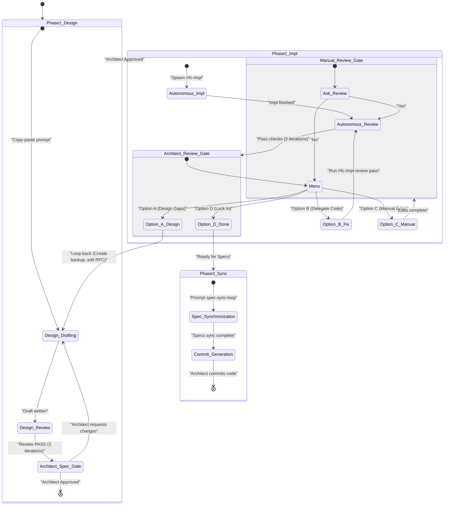

# RFC Pipeline Master Skill

This skill acts as the master orchestrator for the entire Spec-Driven
Development (SDD) lifecycle of an RFC. It manages the state machine, spawns
background agents to run autonomous loops, and guides the human Architect
through interactive phases in strict sequential order. All skill references in
this master orchestrator are prefixed with a slash (e.g., `/rfc-design`) to
indicate they are executable macro tools rather than plain phrases.

## How work is dispatched in Claude Code

Two execution mechanisms, chosen by whether the phase needs a human in the loop:

-   **Autonomous phases → background agents.** Review loops, implementation, and
    fix passes run with no human interaction, so spawn them with the **`Agent`
    tool** using `run_in_background: true`. The harness re-invokes this
    orchestrator with the agent's final report when it finishes, so you can
    spawn, then continue once notified — no polling required. Background agents
    inherit the current working directory and share this workspace (do **not**
    pass `isolation: "worktree"` — the implementation must land in the real
    repo).
-   **Interactive phases → a separate conversation.** Design and spec-sync need
    live back-and-forth with the Architect, which a background agent cannot do.
    For these, give the Architect a copy-pasteable prompt to run in a **new
    conversation**, then pause and wait for them to return. The stated reason is
    *"to keep my context window clean so I can stay focused on my job."*

Use `subagent_type: general-purpose` for all background agents (it has full
tool access and can invoke the sibling skills). Continue an existing background
agent with `SendMessage` if you need to hand it a follow-up without losing its
context; otherwise spawn a fresh agent per phase.

## Critical Behaviours

-   **Codebase Root Directory**: The orchestrator tracks the absolute target
    codebase root path as a required state parameter (`<codebase-root>`) and
    passes it explicitly to every interactive prompt and background-agent
    invocation. **Default `<codebase-root>` to the current working directory.**
    Only prompt the Architect for it if the work targets a different repository
    than the one this conversation is running in. Example form:
    `/Users/<you>/work/<project>`.
-   **Context Window Protection**: To prevent context bloat, the orchestrator
    MUST NOT run autonomous phases (review loops, implementation runs) inline in
    this conversation. Dispatch them per the two mechanisms above — background
    agents for autonomous work, a copy-pasteable new-conversation prompt for
    interactive work.
-   **Transparency before spawning**: Immediately before spawning any background
    agent, print one line in the chat stream naming the agent and its task, e.g.
    `Spawning agent "RFC review loop — <rfc-file>": <one-line task summary>`.
    When you instruct a background agent that it may itself spawn nested agents,
    require it to list any nested agents it launched (name + task) in its final
    report, so you can surface them to the Architect. (Claude Code does not
    deliver live mid-run notifications from a background agent, so capture this
    in the agent's returned summary rather than expecting an interrupt.)

## 🗺️ Lifecycle State Machine

## The Pipeline Lifecycle

Guide the Architect through the following phases sequentially:

### Phase 1: Design

1.  **Interactive Design (Separate Conversation)**: To protect this orchestrator
    conversation from context bloat, do NOT execute the interactive design phase
    here. Instead:

    -   Instruct the Architect to open a **new conversation** and run the
        `/rfc-design` skill to collaboratively draft the RFC.
    -   Explain that this is required *"to keep my context window clean so I can
        stay focused on my job."*
    -   Provide an explicit, copy-pasteable prompt they can use that includes
        the **current codebase root path** (e.g., `"Run /rfc-design to design a
        new feature in <codebase-root>: <brief-description>"`).
    -   Instruct them to return to this conversation and provide the target file
        path (e.g., `rfc/<rfc-file>.md`) once the draft is successfully written.
    -   Pause and wait for the Architect's input.

2.  **Autonomous Review Loop**: Do NOT ask the Architect to copy-paste prompts.
    Instead, spawn a background agent with the **`Agent`** tool:

    -   **subagent_type**: `general-purpose`
    -   **description**: `RFC review loop — <rfc-file>`
    -   **run_in_background**: `true`
    -   **prompt**: `"Invoke the /rfc-review-loop skill on target RFC
        rfc/<rfc-file>.md with 3 iterations. The codebase root is
        <codebase-root>. Return a final summary report of every change made to
        the RFC."`

    Print the transparency line first, then spawn. Pause; when the harness
    notifies you the agent has completed, present its final summary report to
    the Architect.

3.  **Architect Review**:

    -   To prevent automatic progression when reviews modify the RFC, the Master
        Orchestrator MUST NOT proceed directly to Phase 2.
    -   **Verifying Diffs**: Run a `git diff` (or `git status`) check to capture
        exactly what changes were applied to `rfc/<rfc-file>.md` during the
        review loop.
    -   **Walk-through**: Present a clear, structured line-by-line markdown diff
        of all additions and deletions made to the RFC to the Architect.
    -   **Decisive Action**: Explicitly ask the Architect: *"Are you satisfied
        with these RFC design updates? Please reply 'yes' or 'approve' to
        authorize Phase 2: Implementation. If you would like to make further
        modifications to the design first, please specify them and I will give
        you a prompt to pass them to /rfc-design in a new conversation."*
    -   **Loop Back**: If the Architect specifies changes or is unsatisfied,
        guide them to refine the RFC text and then loop back to **Step 2
        (Autonomous Review Loop)** to re-verify the design. Do NOT spawn
        implementation until explicit approval is gained in this step.

### Phase 2: Implementation

1.  **Autonomous Implementation**: Do NOT ask the Architect to copy-paste
    prompts. Spawn a background agent with the **`Agent`** tool:

    -   **subagent_type**: `general-purpose`
    -   **description**: `RFC implementation — <rfc-file>`
    -   **run_in_background**: `true`
    -   **prompt**: `"Invoke the /rfc-impl skill on RFC rfc/<rfc-file>.md to
        execute the implementation plan. The codebase root is <codebase-root>.
        If you spawn any nested agents, list them (name + task) in your final
        report."`

    Print the transparency line first, then spawn. Pause and wait for the agent
    to complete.

2.  **Autonomous Implementation Review**: Once implementation is complete, spawn
    a background agent with the **`Agent`** tool:

    -   **subagent_type**: `general-purpose`
    -   **description**: `RFC impl review — <rfc-file>`
    -   **run_in_background**: `true`
    -   **prompt**: `"Invoke the /rfc-impl-review-loop skill on target RFC
        rfc/<rfc-file>.md with 3 iterations. The codebase root is
        <codebase-root>. Return the final review findings, changes made, and an
        uncommitted-diff summary."`

    Pause and wait for the agent to complete. Once it finishes, present the final
    review findings, changes made, and the uncommitted diff summary to the
    Architect. You MUST explicitly verify that the generated review report
    contains a `Test Verification Completeness Check` section with a passing
    status. If it does not, or if the status is FAILED, you must halt and
    request revisions.

3.  **Architect Implementation Review**: Once the autonomous reviews and fixes
    pass (or if the Architect requests intermediate iterations), present the
    final/current implementation state to the Architect.

    -   **Immediate RFC Backup**: Immediately take a backup snapshot copy of the
        current RFC file (e.g., copy `rfc/<rfc-file>.md` to a temporary file
        under `.scratch/`, such as `.scratch/<rfc-file>.md.bak`). `.scratch/` is
        a gitignored directory for transient pipeline output; create it if
        absent. This MUST be done every time this step starts, so a clean
        reference point is preserved in case the Architect chooses Option A.
    -   Generate a persistent artifact `.scratch/implementation_diff.md`. This
        artifact MUST contain a structured walkthrough AND the **actual code
        diff blocks** (in standard `git diff` format) showing every line that
        was added, modified, or deleted.
    -   Clearly print and describe the three options below to the Architect in
        your response, helping them choose how to iterate:

    #### Option A: Refine the RFC Design (If design gaps/missing instructions are found)

    If the Architect determines that the design itself was incomplete or needs
    to change:

    1.  Instruct the Architect to open a **new conversation** to refine the
        design, explaining that this is necessary *"to keep my context window
        clean so I can stay focused on my job."*
    2.  Provide this exact copy-pasteable prompt: `"Run /rfc-design to refine
        the design of the existing RFC: rfc/<rfc-file>.md. Discuss the following
        updates: <Architect-inputs>"`
    3.  Pause and wait for them to return once the RFC has been updated.
    4.  Once they return:
        -   **Verify RFC Diffs**: Immediately run `git diff --no-index
            .scratch/<rfc-file>.md.bak rfc/<rfc-file>.md` (or `diff -u` if the
            backup is untracked) to capture exactly what design changes were
            made. Present this diff to the Architect for verification, then
            delete the backup snapshot.
        -   **Surgical Patch Re-run**: Spawn a background agent running
            `/rfc-impl-fix` to apply only the RFC design changes incrementally
            to the existing implementation. You MUST pass the captured RFC
            design diff as the action items to implement:
            -   **subagent_type**: `general-purpose`
            -   **description**: `RFC impl fix — <rfc-file>`
            -   **run_in_background**: `true`
            -   **prompt**: `"Invoke the /rfc-impl-fix skill on target RFC
                rfc/<rfc-file>.md. Treat the following captured RFC design diff
                as the targeted action items to implement in the existing
                codebase: <RFC-diff-text>"`

    #### Option B: Delegate Code Corrections (If implementation needs fixing but RFC is correct)

    If the Architect identifies implementation mistakes, bugs, or wants
    different coding approaches within the RFC's boundaries:

    1.  Prompt the Architect to list out their desired changes, feedback, or
        requirements.
    2.  Once the feedback is provided, spawn a background agent running
        `/rfc-impl-fix` to apply the corrections directly:
        -   **subagent_type**: `general-purpose`
        -   **description**: `RFC impl fix — <rfc-file>`
        -   **run_in_background**: `true`
        -   **prompt**: `"Invoke the /rfc-impl-fix skill on target RFC
            rfc/<rfc-file>.md. Treat the following Architect feedback as the
            review report/action items to implement: <Architect-feedback-text>"`
    3.  Wait for the fix agent to complete.
    4.  Once complete, spawn a background `/rfc-impl-review` pass to verify that
        the corrections are correct and that no code standards or test suites
        were broken:
        -   **subagent_type**: `general-purpose`
        -   **description**: `RFC impl review — <rfc-file>`
        -   **run_in_background**: `true`
        -   **prompt**: `"Invoke the /rfc-impl-review skill on target RFC
            rfc/<rfc-file>.md."`
    5.  Wait for the review agent to complete, then present the updated code
        diffs and review results to the Architect, repeating this iteration
        loop.

    #### Option C: Manual Changes by the Architect

    If the Architect makes manual edits/changes directly in their workspace:

    1.  Once they are done, explicitly ask the Architect: *"Would you like to
        run an automated /rfc-impl-review on your manual changes?"*
    2.  If they say yes:
        -   Spawn a background agent running the `/rfc-impl-review` skill:
            -   **subagent_type**: `general-purpose`
            -   **description**: `RFC impl review — <rfc-file>`
            -   **run_in_background**: `true`
            -   **prompt**: `"Invoke the /rfc-impl-review skill on target RFC
                rfc/<rfc-file>.md."`
        -   Wait for it to finish, then present the findings to the Architect
            and ask: *"Would you like the agent to automatically fix these
            findings via /rfc-impl-fix?"*
        -   If they say yes, loop back to **Option B, Step 2** to apply the
            fixes.
    3.  If they say no, ask if they are ready to proceed to Phase 3.

    Repeat this loop until the Architect explicitly states they are done and
    satisfied (e.g., "done", "looks good", "ready for specs").

### Phase 3: Specs & Commit

1.  **Specification Synchronization**: For every directory that was modified
    during the implementation phase, instruct the Architect to run the
    `/spec-sync-loop` skill. Explain that they must open a **new conversation**
    to do this *"to keep my context window clean so I can stay focused on my
    job."* Provide an explicit, copy-pasteable prompt they can use to start the
    new conversation. This will ensure that all `SPEC.md` files are strictly
    verified and updated via interactive `/spec-editor` sessions before the code
    is committed. If a directory does not yet have a `SPEC.md` file, explicitly
    instruct the Architect to run the `/spec-writer` skill first to
    generate/author a new specification from the codebase and relevant RFCs
    before running the sync loop.

    -   **CRITICAL:** Do NOT print the final commit messages during this step.
        Simply instruct them to sync the specs and return here once done.

2.  **Commit Message Generation & Code Approval**: Once the Architect confirms
    the `SPEC.md` sync changes are done:

    -   Ingest the final uncommitted workspace diff.
    -   Generate and provide two formatted commit messages for the Architect to
        copy-paste (following the repository's commit guidelines): one for the
        new/updated RFC markdown document, and one for the actual code
        implementation (including the synchronized specs).
    -   Instruct them to verify everything locally and manually commit the
        changes once they approve. Wait for their confirmation that the code is
        committed.
