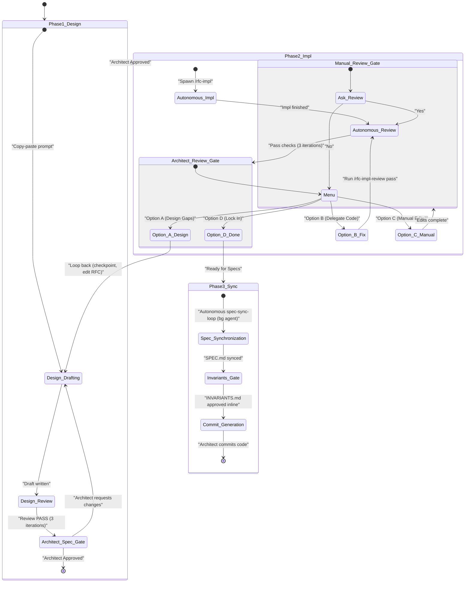

# RFC Pipeline Master Skill

This skill acts as the master orchestrator for the entire Spec-Driven
Development (SDD) lifecycle of an RFC. It manages the state machine, spawns
background agents to run autonomous loops, and guides the human Architect
through interactive phases in strict sequential order. All skill references in
this master orchestrator are prefixed with a slash (e.g., `/rfc-design`) to
indicate they are executable macro tools rather than plain phrases.

## How work is dispatched in Claude Code

Two execution mechanisms, chosen by whether the phase needs a human in the loop:

- **Autonomous phases → background agents.** Review loops, implementation, and
  fix passes run with no human interaction, so spawn them with the **`Agent`
  tool** using `run_in_background: true`. The harness re-invokes this
  orchestrator with the agent's final report when it finishes, so you can spawn,
  then continue once notified — no polling required. Every spawn MUST direct the
  agent at this run's dedicated **pipeline worktree** (`<codebase-root>`,
  created in Phase 0): pass it as the codebase root and have the agent operate
  inside it. Do **not** pass the Agent tool's `isolation: "worktree"` — that
  creates an _ephemeral_ worktree the harness auto-deletes; this pipeline uses a
  _persistent_ worktree on the `pipeline/rfc-<n>` branch instead. Running each
  pipeline in its own worktree is exactly what lets multiple RFC pipelines
  proceed concurrently without colliding on a shared working tree.
- **Interactive phases → a separate conversation.** Design needs live
  back-and-forth with the Architect, which a background agent cannot do. For it,
  give the Architect a copy-pasteable prompt to run in a **new conversation**,
  then pause and wait for them to return. The stated reason is _"to keep my
  context window clean so I can stay focused on my job."_ Note that **SPEC.md
  synchronization is no longer interactive** — it is LLM-managed and runs as a
  background agent (Phase 3a). The only Phase 3 human touchpoint is the
  **minimal, inline** review gate for `INVARIANTS.md` (Phase 3b), handled in
  this orchestrator conversation, not a separate one.

Use `subagent_type: general-purpose` for all background agents (it has full tool
access and can invoke the sibling skills). Continue an existing background agent
with `SendMessage` if you need to hand it a follow-up without losing its
context; otherwise spawn a fresh agent per phase.

**Review-agent model policy.** This pipeline is heavyweight and its reviews are
adversarial, so **run it on a capable session model.** The review _orchestrators_
— the Phase 1 `/rfc-review-loop` (RFC design review) and **every**
`/rfc-impl-review` / `/rfc-impl-review-loop` pass in Phase 2 — are **not** pinned;
they inherit that session model and so never go stale as models change. The
**only** model pinned anywhere in this pipeline is the **leaf** reviewers: the
code-review and design-review chains fan out to many small parallel agents, and
those are held to a mid tier (cheaper than the expected session model) via the
`code-reviewer` and `design-reviewer` agent definitions in `.claude/agents/`.
That single pin — `model:` in those two files — is the one place to revisit if
the model lineup ever reshuffles.

## Critical Behaviours

- **Codebase Root Directory**: The orchestrator tracks the absolute path of this
  run's dedicated pipeline worktree as a required state parameter
  (`<codebase-root>`) and passes it explicitly to every interactive prompt and
  background-agent invocation. **`<codebase-root>` is the worktree created in
  Phase 0** (e.g. `../unicoach-rfc-<n>` resolved to an absolute path), NOT the
  directory this conversation runs in. The orchestrator's own shell stays in the
  original checkout, so every git command it runs MUST target the worktree —
  either `git -C "<codebase-root>" …` or by running from that directory.
- **Context Window Protection**: To prevent context bloat, the orchestrator MUST
  NOT run autonomous phases (review loops, implementation runs) inline in this
  conversation. Dispatch them per the two mechanisms above — background agents
  for autonomous work, a copy-pasteable new-conversation prompt for interactive
  work.
- **Transparency before spawning**: Immediately before spawning any background
  agent, print one line in the chat stream naming the agent and its task, e.g.
  `Spawning agent "RFC review loop — <rfc-file>": <one-line task summary>`. When
  you instruct a background agent that it may itself spawn nested agents,
  require it to list any nested agents it launched (name + task) in its final
  report, so you can surface them to the Architect. (Claude Code does not
  deliver live mid-run notifications from a background agent, so capture this in
  the agent's returned summary rather than expecting an interrupt.)

## Change Tracking, Checkpoints & Agent Write-Scope

The pipeline runs many subagents against this run's **dedicated worktree**
across many steps. To make every step's delta inspectable, every agent's writes
verifiable, and a stalled or rogue agent recoverable, the orchestrator tracks
all state on a **pipeline branch checked out in its own git worktree**, with
**checkpoint commits**, and verifies each agent's footprint against a declared
**write-scope allowlist**. Because each run has its own worktree and branch,
concurrent pipelines never contend for the working tree.

> Convention: throughout this section the bare `git …` shown in command snippets
> is shorthand for `git -C "<codebase-root>" …`. The orchestrator's shell is not
> inside the worktree, so it must always target it explicitly.

### Phase 0 — pipeline worktree (before Phase 1)

**First, pick the next free RFC number `<n>` — and claim it by creating the
worktree.** The committed `rfc/NN-*.md` files are NOT the only claim on a
number: a concurrent pipeline reserves its number the moment it creates the
`pipeline/rfc-<n>` branch and worktree, **before** any RFC file is committed.
Choosing a number by looking only at committed files will collide with an
in-flight pipeline. So `<n>` must be greater than **both**:

- the highest committed `rfc/NN-*.md`, **and**
- the highest existing `pipeline/rfc-NN` branch or `../unicoach-rfc-NN`
  worktree.

```sh
ls rfc/ | grep -oE '^[0-9]+' | sort -n | tail -1          # highest committed RFC file
git branch --list 'pipeline/rfc-*'                         # branches already claiming a number
git worktree list                                          # worktrees already claiming a number
```

Take `<n>` = one past the max across all three. An existing `pipeline/rfc-<k>`
branch or worktree — even one that is empty, clean, and sitting at the base
commit — is an **active ownership claim by another run**; never reuse or
repurpose it, treat its number as taken and move past it. **Creating your own
worktree is what locks in your ownership**, so do it immediately and atomically
before any design work, so a parallel pipeline starting at the same moment sees
your branch and skips your number.

Then create a dedicated worktree on a new pipeline branch off the default
branch, and record the base commit. The worktree isolates this run so several
pipelines can proceed at once:

```sh
git rev-parse main                                          # base commit — record the literal SHA
git worktree add -b pipeline/rfc-<n> ../unicoach-rfc-<n> main
```

If `git worktree add` fails because the branch or path already exists, you
guessed a taken number — bump `<n>` and retry rather than forcing past it.

Set `<codebase-root>` to the absolute path of `../unicoach-rfc-<n>` and use it
as the target for every agent and every `git -C "<codebase-root>" …` command.
All pipeline work — RFC edits, implementation, spec sync — happens in this
worktree on the `pipeline/rfc-<n>` branch. The default branch and the original
checkout are never touched until the Architect commits at Phase 3.

**Persist SHAs in orchestrator state, not shell variables.** The Bash tool's
shell state does not survive between calls, so a `base=$(…)` variable is gone by
the next command. Record the **literal base SHA** in your own tracked state, and
capture each checkpoint's **literal SHA** as you create it (the commit prints
it, or `git rev-parse HEAD`). Diff and squash against those recorded SHAs — do
not rely on a shell variable or on diffing by commit message (git cannot diff by
message; resolve via the captured SHA or `git log --grep`).

### Checkpoints

A checkpoint is a WIP commit capturing the **entire** working tree (tracked and
untracked) at a gate boundary:

```sh
git add -A && git commit -m "pipeline(rfc-<n>): <step> [<i>]"
```

- **Checkpoint at every gate boundary**: immediately before and after each
  subagent spawn, and before each Architect review. Never checkpoint while an
  agent is mid-write — the snapshot must be consistent.
- **Number every loopable step.** Any step the state machine can repeat —
  `review-loop`, `impl-review`, `impl-fix`, `architect-review` — carries a
  monotonic `[i]` counter. Counters are **monotonic per step-type across the
  whole run and never reused**: if the Architect loops back and re-runs reviews,
  they continue `[4] [5] …`, they do not reset. A number therefore identifies a
  unique moment. Non-loop steps omit the counter.

### Diffs for the Architect walkthrough

Per-step delta and cumulative diff are plain git:

```sh
git diff <prev-checkpoint> <this-checkpoint> -- rfc/<rfc-file>.md   # what one step changed
git diff <base-sha> HEAD                                            # full cumulative diff
```

Build every walkthrough and the `.scratch/implementation_diff.md` artifact from
these. `.scratch/` is the home for transient artifacts (diff walkthroughs, agent
reports); it is gitignored and never committed.

### Recovery

Because each gate is a commit, a stalled, crashed, or rogue agent is undone
cleanly:

```sh
git reset --hard <last-good-checkpoint> && git clean -fd
```

Then re-run the step or escalate to the Architect. A checkpoint commit is a
restore point, so recovery is exact and immediate.

### Agent write-scope contract (enforced, not trusted)

Subagent self-reports are not authoritative. The tree is at a clean checkpoint
before every spawn, so after the agent returns `git status --porcelain` is its
**exact** footprint. Every spawn declares an allowlist; the orchestrator asserts
the footprint is a subset of it.

| Agent                             | May write (tracked)      | Post-run assertion                                                                                       |
| --------------------------------- | ------------------------ | -------------------------------------------------------------------------------------------------------- |
| `/rfc-review-loop`                | `rfc/<rfc-file>.md` only | porcelain ⊆ {the RFC}; any code/test write ⇒ **FAIL**                                                    |
| `/rfc-impl-review`, review chains | nothing                  | porcelain **empty** ⇒ pass; else **FAIL**                                                                |
| `/rfc-impl`, `/rfc-impl-fix`      | code, tests, config      | porcelain contains **no `*/SPEC.md` and no `*/INVARIANTS.md`** (the Spec/Invariants Touch Ban, enforced) |

- `.scratch/` is gitignored, so review/impl chains may write reports there
  freely — those writes never appear in `git status --porcelain` and need no
  allowlist exception.
- A net-zero edit (modify then revert) is invisible and acceptable.
- On any violation: surface it to the Architect,
  `git reset --hard
    <checkpoint> && git clean -fd` to discard the rogue
  writes, then re-run or escalate. Do NOT silently keep out-of-scope writes.

### Independent verification (never trust "green")

Write-scope verifies _where_ an agent wrote, not whether its logic is correct.
Separately, **before reporting any test result as passing, the orchestrator
re-runs the suite itself** via the project's test harness and reads the real
pass/fail counts. Never relay an agent's "all tests pass" claim without an
independent run — agent reports have been wrong, and a green claim has masked a
broken tree.

### Subagent rules (state these in every spawn prompt)

- **Never `git commit`** — the orchestrator owns all checkpoints.
- **Never `git stash`** — it mutates shared state and can strand the tree if the
  agent crashes mid-stash. Use `git diff HEAD` for any baseline.

### Phase 3 squash

At Phase 3, collapse all WIP checkpoints into the clean final commits, using the
**recorded base SHA**:

```sh
git reset --soft <base-sha>
```

The working tree and index are preserved; only the WIP history is dropped. Then
create the Architect's two commits (RFC doc; code + specs). The checkpoint
history never leaves the pipeline branch.

## 🗺️ Lifecycle State Machine



## The Pipeline Lifecycle

Guide the Architect through the following phases sequentially. **Before Phase 1,
run Phase 0** (create the `pipeline/rfc-<n>` branch and record the base SHA) per
**Change Tracking, Checkpoints & Agent Write-Scope** above. Throughout, take a
checkpoint at every gate boundary, number every loopable step, verify each
agent's write-scope on return, and independently re-run tests before reporting
any result as green.

### Phase 1: Design

1. **Interactive Design (Separate Conversation)**: To protect this orchestrator
   conversation from context bloat, do NOT execute the interactive design phase
   here. Instead:

   - Instruct the Architect to open a **new conversation** and run the
     `/rfc-design` skill to collaboratively draft the RFC.
   - Explain that this is required _"to keep my context window clean so I can
     stay focused on my job."_
   - Provide an explicit, copy-pasteable prompt they can use that includes the
     **current codebase root path** (e.g.,
     `"Run /rfc-design to design a
        new feature in <codebase-root>: <brief-description>"`).
   - Instruct them to return to this conversation and provide the target file
     path (e.g., `rfc/<rfc-file>.md`) once the draft is successfully written.
   - Pause and wait for the Architect's input.

2. **Autonomous Review Loop**: Do NOT ask the Architect to copy-paste prompts.
   Instead, spawn a background agent with the **`Agent`** tool:

   - **subagent_type**: `general-purpose`
   - **description**: `RFC review loop — <rfc-file>`
   - **run_in_background**: `true`
   - **prompt**:
     `"Invoke the /rfc-review-loop skill on target RFC
        rfc/<rfc-file>.md with 3 iterations. The codebase root is
        <codebase-root>. Return a final summary report of every change made to
        the RFC."`

   Checkpoint before spawning (`pipeline(rfc-<n>): before review-loop [i]`). The
   spawn prompt MUST state the **write-scope** (`rfc/<rfc-file>.md` only) and
   the subagent rules (never commit, never stash). Print the transparency line
   first, then spawn. Pause; when the harness notifies you the agent has
   completed, **verify its write-scope** (`git status --porcelain` ⊆ the RFC;
   any code/test write ⇒ reset and escalate), checkpoint the result
   (`pipeline(rfc-<n>): after review-loop [i]`), then present its final summary
   report to the Architect.

3. **Architect Review**:

   - To prevent automatic progression when reviews modify the RFC, the Master
     Orchestrator MUST NOT proceed directly to Phase 2.
   - **Verifying Diffs**: Diff the two review-loop checkpoints to capture
     exactly what the loop changed:
     `git diff "pipeline(rfc-<n>): before
        review-loop [i]" "pipeline(rfc-<n>): after review-loop [i]" --
        rfc/<rfc-file>.md`
     (resolve the messages to SHAs as needed). Because the RFC is committed in
     the checkpoint, a plain `git diff` against the working tree alone would
     miss it — diff the checkpoints.
   - **Walk-through**: Present a clear, structured line-by-line markdown diff of
     all additions and deletions made to the RFC to the Architect.
   - **Decisive Action**: Explicitly ask the Architect: _"Are you satisfied with
     these RFC design updates? Please reply 'yes' or 'approve' to authorize
     Phase 2: Implementation. If you would like to make further modifications to
     the design first, please specify them and I will give you a prompt to pass
     them to /rfc-design in a new conversation."_
   - **Loop Back**: If the Architect specifies changes or is unsatisfied, guide
     them to refine the RFC text and then loop back to **Step 2 (Autonomous
     Review Loop)** to re-verify the design. Do NOT spawn implementation until
     explicit approval is gained in this step.

### Phase 2: Implementation

1. **Autonomous Implementation**: Do NOT ask the Architect to copy-paste
   prompts. Spawn a background agent with the **`Agent`** tool:

   - **subagent_type**: `general-purpose`
   - **description**: `RFC implementation — <rfc-file>`
   - **run_in_background**: `true`
   - **prompt**:
     `"Invoke the /rfc-impl skill on RFC rfc/<rfc-file>.md to
        execute the implementation plan. The codebase root is <codebase-root>.
        If you spawn any nested agents, list them (name + task) in your final
        report."`

   Checkpoint before spawning (`pipeline(rfc-<n>): before impl`); the spawn
   prompt MUST state the **write-scope** (code, tests, config — but **no
   `*/SPEC.md` and no `*/INVARIANTS.md`**) and the subagent rules (never commit,
   never stash). Print the transparency line first, then spawn. Pause and wait
   for the agent to complete. On return, **verify write-scope**
   (`git status
   --porcelain` contains no `*/SPEC.md` and no
   `*/INVARIANTS.md`), **independently re-run the test suite** (do not trust the
   agent's green claim), and checkpoint (`pipeline(rfc-<n>): impl`).

2. **Autonomous Implementation Review**: Once implementation is complete, spawn
   a background agent with the **`Agent`** tool:

   - **subagent_type**: `general-purpose`
   - **description**: `RFC impl review — <rfc-file>`
   - **run_in_background**: `true`
   - **prompt**:
     `"Invoke the /rfc-impl-review-loop skill on target RFC
        rfc/<rfc-file>.md with 3 iterations. The codebase root is
        <codebase-root>. Return the final review findings, changes made, and an
        uncommitted-diff summary."`

   The spawn prompt MUST state the **write-scope** (the review writes nothing
   tracked; reports go to gitignored `.scratch/`) and the subagent rules. Number
   this loopable step (`impl-review [i]`). Pause and wait for the agent to
   complete. On return, **verify write-scope** (`git status --porcelain` empty —
   a review that edited source ⇒ reset and escalate). Once it finishes, present
   the final review findings, changes made, and the uncommitted diff summary to
   the Architect. You MUST explicitly verify that the generated review report
   contains a `Test Verification Completeness Check` section with a passing
   status; **and independently re-run the suite yourself** to confirm it — do
   not rely on the report's claim alone. If the section is missing, the status
   is FAILED, or your own run does not pass, halt and request revisions.

3. **Architect Implementation Review**: Once the autonomous reviews and fixes
   pass (or if the Architect requests intermediate iterations), present the
   final/current implementation state to the Architect.

   - **Immediate Checkpoint**: Take an `architect-review [i]` checkpoint at the
     start of this step every time it is entered
     (`git add -A && git
        commit -m "pipeline(rfc-<n>): architect-review [i]"`).
     This is the clean reference point preserved in case the Architect chooses
     Option A.
   - Generate a persistent artifact `.scratch/implementation_diff.md` from
     `git diff <base-sha> HEAD`. This artifact MUST contain a structured
     walkthrough AND the **actual code diff blocks** (in standard `git diff`
     format) showing every line that was added, modified, or deleted.
   - Clearly print and describe the three options below to the Architect in your
     response, helping them choose how to iterate:

   #### Option A: Refine the RFC Design (If design gaps/missing instructions are found)

   If the Architect determines that the design itself was incomplete or needs to
   change:

   1. Instruct the Architect to open a **new conversation** to refine the
      design, explaining that this is necessary _"to keep my context window
      clean so I can stay focused on my job."_
   2. Provide this exact copy-pasteable prompt:
      `"Run /rfc-design to refine
        the design of the existing RFC: rfc/<rfc-file>.md. Discuss the following
        updates: <Architect-inputs>"`
   3. Pause and wait for them to return once the RFC has been updated.
   4. Once they return:
      - **Verify RFC Diffs**: Diff the working-tree RFC against the
        `architect-review [i]` checkpoint taken at the start of this step
        (`git diff "pipeline(rfc-<n>): architect-review [i]" --
            rfc/<rfc-file>.md`)
        to capture exactly what design changes were made. Present this diff to
        the Architect for verification; the checkpoint is the reference.
      - **Surgical Patch Re-run**: Checkpoint the Architect's RFC edit
        (`pipeline(rfc-<n>): rfc-refine [i]`), then spawn a background agent
        running `/rfc-impl-fix` to apply only the RFC design changes
        incrementally to the existing implementation. The spawn prompt MUST
        state the **write-scope** (code, tests, config — **no `*/SPEC.md` and no
        `*/INVARIANTS.md`**) and the subagent rules. You MUST pass the captured
        RFC design diff as the action items to implement:
        - **subagent_type**: `general-purpose`
        - **description**: `RFC impl fix — <rfc-file>`
        - **run_in_background**: `true`
        - **prompt**:
          `"Invoke the /rfc-impl-fix skill on target RFC
                rfc/<rfc-file>.md. Treat the following captured RFC design diff
                as the targeted action items to implement in the existing
                codebase: <RFC-diff-text>"`

   #### Option B: Delegate Code Corrections (If implementation needs fixing but RFC is correct)

   If the Architect identifies implementation mistakes, bugs, or wants different
   coding approaches within the RFC's boundaries:

   1. Prompt the Architect to list out their desired changes, feedback, or
      requirements.
   2. Once the feedback is provided, spawn a background agent running
      `/rfc-impl-fix` to apply the corrections directly:
      - **subagent_type**: `general-purpose`
      - **description**: `RFC impl fix — <rfc-file>`
      - **run_in_background**: `true`
      - **prompt**:
        `"Invoke the /rfc-impl-fix skill on target RFC
            rfc/<rfc-file>.md. Treat the following Architect feedback as the
            review report/action items to implement: <Architect-feedback-text>"`
   3. Wait for the fix agent to complete.
   4. Once complete, spawn a background `/rfc-impl-review` pass to verify that
      the corrections are correct and that no code standards or test suites were
      broken:
      - **subagent_type**: `general-purpose`
      - **description**: `RFC impl review — <rfc-file>`
      - **run_in_background**: `true`
      - **prompt**:
        `"Invoke the /rfc-impl-review skill on target RFC
            rfc/<rfc-file>.md."`
   5. Wait for the review agent to complete, then present the updated code diffs
      and review results to the Architect, repeating this iteration loop.

   #### Option C: Manual Changes by the Architect

   If the Architect makes manual edits/changes directly in their workspace:

   1. Once they are done, explicitly ask the Architect: _"Would you like to run
      an automated /rfc-impl-review on your manual changes?"_
   2. If they say yes:
      - Spawn a background agent running the `/rfc-impl-review` skill:
        - **subagent_type**: `general-purpose`
        - **description**: `RFC impl review — <rfc-file>`
        - **run_in_background**: `true`
        - **prompt**:
          `"Invoke the /rfc-impl-review skill on target RFC
                rfc/<rfc-file>.md."`
      - Wait for it to finish, then present the findings to the Architect and
        ask: _"Would you like the agent to automatically fix these findings via
        /rfc-impl-fix?"_
      - If they say yes, loop back to **Option B, Step 2** to apply the fixes.
   3. If they say no, ask if they are ready to proceed to Phase 3.

   Repeat this loop until the Architect explicitly states they are done and
   satisfied (e.g., "done", "looks good", "ready for specs").

### Phase 3: Specs, Invariants & Commit

Phase 3 maintains two sibling per-directory documents with strictly separated
mandates:

- **`SPEC.md`** — _descriptive_: what the code does, so an LLM gets context
  without reading every file. **Fully LLM-managed, no human gate.** Synced
  autonomously by a background agent (3a).
- **`INVARIANTS.md`** — _prescriptive_: the few durable guarantees that must
  remain true as the code evolves, each with its WHY. **Human-gated**, but the
  review is minimal because invariants are few. Drafted by a background agent,
  approved **inline in this orchestrator conversation** (3b).

First, determine the set of directories the implementation touched:
`git -C "<codebase-root>" diff --name-only <base-sha> HEAD`, then reduce to the
distinct source directories (exclude `rfc/` and the RFC file itself).

#### 3a. SPEC.md Synchronization (autonomous)

Do NOT ask the Architect to copy-paste prompts and do NOT use `/spec-editor`.
SPEC.md is LLM-managed. Spawn a background agent with the **`Agent`** tool:

- **subagent_type**: `general-purpose`
- **description**: `RFC spec sync — <rfc-file>`
- **run_in_background**: `true`
- **prompt**: instruct it to run `/spec-sync-loop` (3 iterations) on **each**
  touched directory in `<codebase-root>` (creating a new `SPEC.md` via
  `/spec-writer` where one is absent), and to **report any durable guarantee it
  notices that belongs in `INVARIANTS.md`** (it must NOT write `INVARIANTS.md`
  itself). The prompt MUST state the **write-scope** (`*/SPEC.md` files only —
  **no `*/INVARIANTS.md`**, no code/test/config) and the subagent rules (never
  commit, never stash).

Checkpoint before spawning (`pipeline(rfc-<n>): before spec-sync`). Print the
transparency line, then spawn. On return, **verify write-scope**
(`git status
--porcelain` ⊆ `SPEC.md` files; any code/test/`INVARIANTS.md` write
⇒ reset and escalate) and checkpoint (`pipeline(rfc-<n>): spec-sync`).

#### 3b. INVARIANTS.md (autonomous draft, minimal inline human gate)

Spawn a background agent with the **`Agent`** tool:

- **subagent_type**: `general-purpose`
- **description**: `RFC invariants — <rfc-file>`
- **run_in_background**: `true`
- **prompt**: instruct it to run `/invariants-writer` on **each** touched
  directory in `<codebase-root>`, distilling the few true invariants from each
  directory's `SPEC.md` + code + in-scope RFCs through the five-gate filter, and
  to **return the proposed `INVARIANTS.md` drafts plus the filter rationale**
  (what it kept and, briefly, what it filtered out and why). It MUST NOT write
  any `INVARIANTS.md` file to disk — `INVARIANTS.md` is human-gated; the
  orchestrator owns the write. Many directories will legitimately yield **zero**
  invariants and therefore **no file** — that is expected. The prompt MUST state
  the **write-scope** (writes nothing tracked; reports only) and the subagent
  rules.

Checkpoint before spawning (`pipeline(rfc-<n>): before invariants`). On return,
**verify write-scope** (`git status --porcelain` empty). Then run the **inline
human gate**: present each proposed `INVARIANTS.md` (they are short — a handful
of lines each) to the Architect in this conversation, note which directories
yielded no invariants, and ask for approval or edits. Apply the
Architect-approved invariants by writing the `INVARIANTS.md` files yourself,
then checkpoint (`pipeline(rfc-<n>): invariants`).

- **CRITICAL:** Do NOT print the final commit messages during this step.

#### 3c. Commit Message Generation & Code Approval

Once the SPEC.md sync is done and the Architect has approved the `INVARIANTS.md`
files:

- **Squash the pipeline checkpoints**: collapse all WIP checkpoints into a clean
  staging state with `git reset --soft <base-sha>` (the recorded base SHA;
  working tree and index preserved, only the WIP history dropped). The two final
  commits are created from this state.
- **Final independent test run**: before generating commit messages, re-run the
  suite yourself (project test harness) and confirm it is green — do not rely on
  any earlier agent report.
- Ingest the final workspace diff (`git diff <base-sha>` / `git status`).
- Generate and provide two formatted commit messages for the Architect to
  copy-paste (following the repository's commit guidelines): one for the
  new/updated RFC markdown document, and one for the actual code implementation
  (including the synchronized `SPEC.md` and the approved `INVARIANTS.md` files).
- Instruct them to verify everything locally and manually commit the changes
  once they approve. Wait for their confirmation that the code is committed.

3. **Land the branch & tear down the worktree**: Once the Architect confirms the
   commits exist on `pipeline/rfc-<n>` (inside the worktree), help them land the
   branch on the default branch and remove the now-redundant worktree. Run these
   from the original checkout (not from inside the worktree):

   ```sh
   git -C "<original-checkout>" merge --ff-only pipeline/rfc-<n>   # or open a PR from the branch
   git worktree remove ../unicoach-rfc-<n>                         # delete the worktree
   git branch -d pipeline/rfc-<n>                                  # delete the merged branch
   ```

   `git worktree remove` refuses if the worktree still has uncommitted changes —
   treat that as a safety check, not an obstacle to force past. After removal
   the run is fully wound down and another pipeline may take its place.
