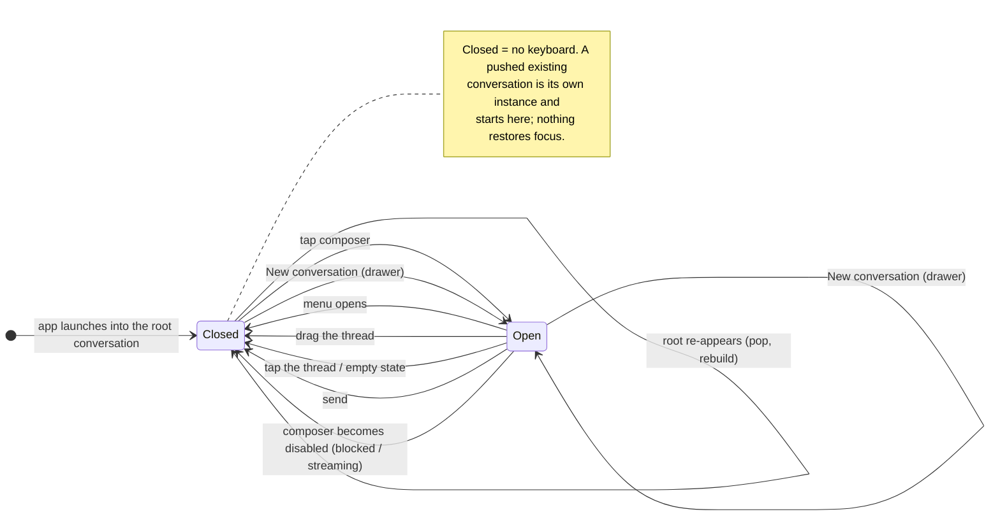

# Unicoach iOS — Design Specification

Derived from the style reference at
[`rfc/artifacts/116/iOS.jpg`](../rfc/artifacts/116/iOS.jpg) (login + onboarding
mockups), measured against a 393pt-wide device (iPhone 16 class). This is the
durable source of truth for the app's visual language: prefer editing this file
and the token layer (`DesignSystem/Theme.swift`, `Assets.xcassets/*.colorset`)
over restyling individual views.

Unlike an RFC, this document is **living** — it is updated in place as the
design evolves, not superseded by a higher-numbered file.

## 0. How to read this spec

**The tokens are the contract; the numbers are only their definitions.** A view
must read `DSControl.height`, never re-type `64`. Once it does, the rendered
dimension is correct by construction — so a screenshot measured against this
table confirms only what the token already guaranteed. Exactness is enforced in
the diff, by the absence of magic numbers, not in the pixels.

**The mockup is a reference, not a contract.** It is one render at one width.
Values here were measured off it and are _indicative_: they set the rhythm, not
a tolerance. A control that reads as the motif is correct even if it is a few
points from the render.

**Prefer proportional and semantic layout to transcribed constants.** "62% of
the container width" is better than a pixel figure taken off the mockup, because
it survives the device sizes the mockup never showed. Where a relationship can
be expressed structurally — a fraction, an intrinsic size, a `@ScaledMetric`
minimum — express it that way and let this file describe the intent rather than
the arithmetic.

**Clean view code outranks fidelity to the render.** If matching the mockup
exactly would require awkward, brittle, or unreadable SwiftUI, write the clear
version and update this file to describe what was built. The code is the source
of truth (see `rfc/README.md`); this document explains it and must not force it
into contortions.

## 1. Brand

The brand mark is a warm **orange-to-pink linear gradient**, used for the logo
lockup, the app's top chrome, and selection accents. It is the only saturated
colour in the palette; everything else is white, near-black, or grey.

| Token                | Value     | Use                                                                       |
| -------------------- | --------- | ------------------------------------------------------------------------- |
| `brandGradientStart` | `#EE7330` | Gradient origin (leading / top-leading)                                   |
| `brandGradientEnd`   | `#E94577` | Gradient terminus (trailing / bottom-trailing)                            |
| `brandAccentSolid`   | `#EE732F` | Solid accent where a gradient cannot apply (radio fill, small indicators) |

Gradient direction: **leading → trailing** for horizontal chrome (the top bar);
**topLeading → bottomTrailing** for the circular logo mark.

## 2. Colour

Measured from the reference. The reference is **light-mode only**; the dark
palette in §2.1 is derived (Ian's call: keep dark mode).

| Token           | Light     | Colorset                                                                                      |
| --------------- | --------- | --------------------------------------------------------------------------------------------- |
| `Background`    | `#FFFFFF` | `Background`                                                                                  |
| `Surface`       | `#FFFFFF` | `Surface` — flat white; the reference has no grey fills, separation is by border, not by tint |
| `TextPrimary`   | `#000000` | `TextPrimary`                                                                                 |
| `TextSecondary` | `#6E6E6E` | `TextSecondary` — **not** the `#787878` measured off the reference; see §6                    |
| `FieldBorder`   | `#B0B0B0` | `FieldBorder` — borders carry the layout, so they must be visible                             |
| `BrandAccent`   | `#EE732F` | `BrandAccent` — replaced the pre-spec LinkedIn blue `#0A66C2` entirely                        |
| `BrandOnAccent` | `#FFFFFF` | `BrandOnAccent`                                                                               |
| `ControlFill`   | `#030303` | `ControlFill` — near-black fill for primary / SSO buttons                                     |
| `ControlOnFill` | `#FFFFFF` | `ControlOnFill` — label on that fill                                                          |
| gradient stops  | see §1    | `BrandGradientStart` / `BrandGradientEnd`, read through `DSGradient`                          |

`TextSecondary` ships at `#6E6E6E` rather than the `#787878` measured off the
reference: §6 records that the measured value lands at 4.42:1 on white, just
under AA. The reference is a mockup, not an accessibility audit.

These values landed in RFC 116. Before it every one of them still held its
pre-spec value — most consequentially `BrandAccent`, which was LinkedIn blue
`#0A66C2`.

### 2.1 Dark mode (derived)

Dark mode is **kept**, and since RFC 117 it is also **user-selectable**:
Settings carries a System / Light / Dark `SegmentedSelector` backed by
`AppearancePreference`, applied with `.preferredColorScheme` at the root scene
so it governs every auth state rather than only the authenticated tree. `System`
means "follow the device" (`nil`), not a third palette.

The reference's visual logic — flat surfaces, no elevation, separation by
hairline border — inverts cleanly; only the near-black control fill cannot
survive inversion.

| Token           | Dark      | Contrast on background | Note                                                                                       |
| --------------- | --------- | ---------------------- | ------------------------------------------------------------------------------------------ |
| `Background`    | `#0E0E10` | —                      | Near-black, not pure black: keeps hairline borders visible and avoids OLED smear on scroll |
| `BrandOnAccent` | `#FFFFFF` | —                      | Unchanged: the gradient it sits on is not recoloured for dark                              |
| `Surface`       | `#0E0E10` | —                      | Same as background, mirroring light mode's flatness                                        |
| `TextPrimary`   | `#FFFFFF` | 19.3 ✓                 |                                                                                            |
| `TextSecondary` | `#A8A8AD` | 8.1 ✓                  |                                                                                            |
| `FieldBorder`   | `#5A5A5F` | 2.8                    | Decorative only — never text                                                               |
| `BrandAccent`   | `#EE7330` | 6.6 ✓                  | Gradient unchanged; it reads _better_ on dark than on white                                |
| `ControlFill`   | `#FFFFFF` | 19.3 ✓                 | **Inverts.** A `#030303` button on a near-black background is invisible                    |
| `ControlOnFill` | `#000000` | 21.0 ✓                 | Black label on the white fill                                                              |

The one asymmetry worth stating: in light mode the primary/SSO button is a
**near-black fill with a white label**; in dark mode it becomes a **white fill
with a black label**. This is the same inversion Apple's own Sign-in-with-Apple
button performs, so it will look native rather than accidental.

The brand gradient is deliberately _not_ recoloured for dark. It sits at 6.6:1
against `#0E0E10` — stronger than its 2.95:1 against white — so the same two
stops serve both modes.

## 3. Geometry

Measured directly off the reference, normalised to points.

| Token              | Value     | Notes                                                                       |
| ------------------ | --------- | --------------------------------------------------------------------------- |
| `DSRadius.control` | **16**    | Buttons, fields, and option cards share one radius (currently 12/10, split) |
| `DSControl.height` | **64**    | Buttons and option cards are the same height — one control rhythm           |
| `DSSpacing.md`     | 16        | unchanged                                                                   |
| `DSSpacing.lg`     | 24        | screen horizontal margin (measured 24–28)                                   |
| Control stack gap  | **10–12** | vertical gap between stacked buttons / cards                                |
| Top bar height     | **~63**   | gradient chrome, extending under the status bar                             |

The token layer carries these as `DSRadius.control`, `DSControl.height`,
`DSControl.stackGap` (12), `DSControl.borderWidth` (1), `DSControl.textInset`
(20), `DSControl.radioDiameter` (22), and `DSControl.topBarHeight` (44 — the
content height; the gradient itself extends under the status bar to the ~63 the
reference measures). Every control height is applied as a `@ScaledMetric`
minimum rather than a fixed frame, so Dynamic Type grows the box instead of
clipping the label.

Controls are notably **chunky**: 64pt tall against iOS's 44–50pt norm, with a
16pt radius that is emphatically _not_ a capsule (a capsule at this height would
be 32pt). Borders are 1pt hairlines, not fills. There are **no shadows and no
elevation** anywhere in the reference — depth is communicated by outline alone.

## 4. Typography

The reference uses a **bold geometric sans**, not SF. Characteristics: double-
storey `a`, single-storey `g`, geometric numerals, and very heavy weights for
headings — near-black on titles, with tight leading on two-line headings.

**Decision (Ian, this session): SF Pro at heavier weights.** Zero dependency,
ships today, keeps Dynamic Type and every accessibility affordance for free, and
captures roughly 70% of the reference's feel. The face was judged easy to change
later, which it is _provided_ every view reads its type from the tokens below
and never calls `.font(.system(...))` inline — **that discipline is what keeps
the decision reversible**, so treat an inline font as a defect.

Swapping to a bundled geometric sans (Poppins / Montserrat / Archivo class)
later means editing this table and adding `UIFontMetrics` scaling, nothing more.

Scale (weights firmer than the current tokens throughout):

| Token        | Style                                                                             |
| ------------ | --------------------------------------------------------------------------------- |
| `dsDisplay`  | `.largeTitle` / `.heavy` — screen headings ("When will you graduate?")            |
| `dsTitleXL`  | `.largeTitle` / `.bold`                                                           |
| `dsTitle`    | `.title2` / `.bold` (was `.semibold`)                                             |
| `dsBody`     | `.body` / `.regular`                                                              |
| `dsLabel`    | `.subheadline` / `.medium`                                                        |
| `dsOverline` | `.caption` / `.semibold`, uppercase, ~0.08em tracking — "WELCOME, KENDALL"        |
| `dsButton`   | `.headline` / `.semibold`                                                         |
| `dsCaption`  | `.caption` / `.regular`                                                           |
| `dsCode`     | `.body` / `.monospaced` — fenced and inline code in a rendered coach reply (§8.1) |

`dsOverline` is applied through `Text.dsOverlineStyle()`, which carries the
uppercasing and the tracking with the font so the three cannot drift apart.
`Font.dsLogoGlyph(diameter:)` is the one size-taking token: the logo mark's `U`
is artwork, sized from its circle rather than from the type scale. | `dsOption`
| `.title3` / `.bold` — option-card labels, which are far larger than list text
normally is |

## 5. Components

### Primary / SSO button

64pt tall, 16pt radius, `#030303` fill, white label, leading icon inset with the
icon+label pair centred as a group. Stacked with a 10–12pt gap.

### Text field

64pt tall, 16pt radius, white fill, 1pt `#B0B0B0` border, `#B0B0B0` placeholder,
20pt leading text inset.

### Option card

64pt tall, 16pt radius, white fill, 1pt border. Leading radio circle (~22pt),
hollow grey ring unselected, solid `#EE732F` fill selected; the selected card's
border darkens. Trailing label in `dsOption`. This is the reference's signature
control; it is `OptionCard` in `DesignSystem/Components.swift`.

### Top bar

Full-bleed brand gradient extending under the status bar, `uni.COACH` wordmark
in white, leading-aligned, ~44pt of content height. This replaces the stock
`.navigationTitle` chrome on branded screens (`BrandTopBar`); a screen that
adopts it hides the stock navigation bar rather than showing both.

It takes an optional **leading accessory** — today the menu button
(`BrandTopBarButton`). Two things about that button are deliberate and separate:
its **box** is `DSControl.topBarHeight`, which is also the platform's minimum
tap target, and its **glyph** is `Font.dsTopBarGlyph`, a step larger than
`dsButton`. A line symbol set at the wordmark's own point size carries far less
ink than the wordmark does and reads weedy beside it, so glyph size is a token
of its own rather than borrowed from the type scale's button entry.

**The wordmark is artwork; the button is a control, and Dynamic Type treats them
differently.** The same argument that sizes the logo mark's `U` from its circle
rather than from the type scale applies to the logotype: the wordmark's growth
is **capped** at `DSLogo.wordmarkMaxDynamicTypeSize`, is `lineLimit(1)`, and
shrinks (`DSLogo.wordmarkMinScale`) rather than truncating on a narrow device.
Uncapped it hyphenated to "uni.-COACH" at accessibility sizes and tripled the
bar's height on every branded screen. The accessory button is **not** capped — a
control that refuses to grow is an accessibility regression — and neither is
what VoiceOver reports: the label and the `.isHeader` trait are unchanged. The
bar's `DSControl.topBarHeight` minimum is therefore no longer driven past itself
by its own logotype.

### Segmented selector

One outlined `DSRadius.control` container holding N segments; the selected
segment carries a `BrandAccent` fill with a **black** (`OnBrandAccent`) label.
`SegmentedSelector` exists because SwiftUI's `.pickerStyle(.segmented)` renders
a stock grey capsule, which contradicts both §2 (no grey fills) and §3 (not a
capsule).

### Step indicator

Horizontal rail of N circles joined by a 1pt line; current step filled, the rest
hollow (`StepIndicator`). Used for multi-step onboarding — on the
graduation-date screen it shows account → profile → coaching, with profile
current.

### Logo mark

Circular gradient (topLeading → bottomTrailing) with a heavy white `U`, ~62% of
the screen width on the login screen (`LogoMark`, `DSLogo.widthFraction`).

## 6. Accessibility constraints

Measured contrast ratios against the reference palette:

| Pair               | Ratio    | Verdict                                  |
| ------------------ | -------- | ---------------------------------------- |
| White on `#EE7330` | **2.95** | ✗ fails WCAG AA (4.5) and AA-large (3.0) |
| White on `#E94577` | **3.76** | ✗ fails AA; passes AA-large only         |
| Black on `#EE7330` | 7.13     | ✓ passes AA                              |
| `#787878` on white | 4.42     | ~ marginal, just under AA                |
| `#B0B0B0` on white | 2.17     | ✗ decorative borders only — never text   |

**The white `uni.COACH` wordmark on the gradient bar fails contrast.** It is a
logotype rather than body copy, so it is defensible, but nothing else may follow
it onto that gradient. Any text placed on the brand gradient should be black, or
the gradient must be darkened for that surface. Secondary text ships at
`#6E6E6E` rather than the measured `#787878` to clear AA cleanly.

Two consequences bind the whole app, not just the gradient:

- **`BrandAccent` never carries text.** `#EE732F` on white is 2.95:1, so the
  tertiary links that used to be brand-coloured ("Register", "Retry", "Change
  Email") are `TextPrimary`. Brand colour appears as chrome and as the option
  card's selection fill, nowhere else.
- **`BrandAccent` is never a large tappable surface** either, for the same
  reason. Primary and SSO controls are `ControlFill`.

## 7. Navigation

**Decision (Ian, this session): chat-first with a slide-over menu.**
Conversation is the app's primary interface; everything else is secondary and
lives behind a menu rather than competing with it in a tab bar.

Built in RFC 117. Structure:

- The root of the authenticated state is the **conversation view**, not a hub.
  `HomeView`'s three-button menu screen is gone; `AuthenticatedRootView` owns
  the stack, the chat, and the menu overlay.
- A **leading accessory on `BrandTopBar`** opens a slide-over menu (drawer) from
  the leading edge, over a dimmed scrim. Its glyph is black (`OnBrandAccent`),
  not the wordmark's white: the logotype is §6's one sanctioned exception, and
  anything that follows it onto the gradient takes black.
- The drawer and its scrim sit **below the gradient bar, not under it**. The bar
  is the app's identity and stays lit while the menu is open, the button that
  opened the drawer stays where the user left it (and closes it again), and the
  drawer clips to the content area by construction rather than by fighting the
  safe area. Covering the bar was tried first and read as a half-dimmed
  accident.
- The scrim is a **dim, not a shadow** — §3's no-elevation rule holds. In light
  mode it reads as a grey wash. In **dark** mode a flat `#0E0E10` background
  cannot get meaningfully darker, so the dim shows only on the content that has
  contrast (borders, the composer) and the drawer is separated from the scrimmed
  screen by the same 1pt hairline everything else uses. That is the design's own
  answer to separation and it is deliberately not fixed with an elevation
  shadow.
- The menu holds: **New conversation**, the **recent conversations** in the
  server's MRU order, **All conversations**, and a footer entry into
  **Settings**.
- The drawer lists at most `DSMenu.recentLimit` (3) conversations and **does not
  scroll**. A menu that scrolls has no determinate height and hides its own
  footer behind a gesture. The cap lives in the view, not in
  `ConversationListViewModel` — the same view model backs
  `ConversationListView`, which must show everything. This makes **All
  conversations** load-bearing rather than a convenience: past the three most
  recent it is the only route to a conversation, so it stays pinned in the
  footer where it cannot be scrolled away. Its list state is owned by the root,
  not by the drawer, so the drawer slides in already populated: a view model
  rebuilt per open made the rows appear whenever the network returned, sometimes
  mid-animation. The drawer stays in the hierarchy and is hidden by an offset
  rather than by conditional insertion, so it and its contents are one
  animation, and it refreshes without emptying
  (`ConversationListViewModel.refresh()`).
- `ConversationListView` is **kept, not absorbed**. It carries swipe-to-delete,
  archive, the confirmation dialog and the error alert; the drawer's inline list
  is a fast switcher, and duplicating destructive affordances into it would buy
  nothing.
- **Chrome is a function of depth, not of which door you came through.** The
  root is always a _fresh_ conversation: brand chrome, menu button, and no back
  button, because there is nothing behind it. Every _existing_ conversation is a
  **pushed** destination — from the drawer and from All Conversations alike —
  with stock chrome, a title and a back button. An earlier revision let the
  drawer swap the conversation at the root, which gave the same content two
  chromes and two exits depending on the entry point.
- A push gives each conversation its own `ConversationView`, and so its own
  `@StateObject` view model, by construction. That is what removed the earlier
  `.id(selectedConversation)` re-identification trick: with no shared root view
  model to swap underneath, there is no in-flight SSE stream that can be left
  writing into the wrong conversation.
- **Settings** is a new destination holding the student's name and email, the
  appearance preference (§2.1), Change Email, and Log Out. `ChangeEmailView`
  moved to its own file and is used by both call sites, so a verified student
  can now change their email at all — before, it was reachable only from the
  pre-verification blocking screen.
- The **authenticated state** gets exactly one `NavigationStack`.
  `VerificationRequiredView` keeps its own, because it is a sibling _auth
  state_, never on screen at the same time; the two could only share a stack if
  it were hoisted above the auth-state `switch`, which this section forbids —
  that `switch` routes _between_ states, above navigation. (This corrects the
  earlier claim of "four independent `NavigationStack`s": `ConversationView` and
  `ConversationListView` never declared one outside their previews, so the
  collapse was `HomeView`'s alone.)

The menu is a custom overlay, not `NavigationSplitView`: the reference's
full-bleed gradient chrome does not survive stock split-view presentation on
iPhone.

**Built: subscription status and coaching usage (RFC 119).** This section asks
Settings to absorb both, and it now does — as the `SubscriptionSection` between
the appearance section and the button stack, exactly the additive drop-in the
stack-of-sections composition was for.

The earlier note here said neither was buildable because "the server exposes no
GET for subscription state and no usage endpoint of any kind". **The second half
was already wrong when it was written:**
`GET /api/v1/students/me/coaching-usage` shipped with RFC 109 and is what the
coaching meter reads (`usedPercent`, `exhausted`, `resetsAt`, where a null
`resetsAt` is the free tier's lifetime allowance).

The first half is still true and shapes the design: **there is no GET for
subscription state.** The only response carrying a `PublicSubscription` is
`POST /api/v1/subscriptions/verify`, which is documented as idempotent and as
the refresh path — so the client learns its subscription status by re-posting
the current StoreKit entitlement's JWS, and a student with no entitlement simply
has no status line to show. Entitlement itself is never derived on the client:
the meter renders the server's own answer, and nothing inspects `status` or
`currentPeriodEnd` to unlock anything.

### 7.1 Composer focus and the keyboard (RFC 127)

The keyboard is navigation too: it covers half the screen, and the drawer this
section specifies opens over it. **This is the maintained copy of the model** —
RFC 127 holds the record of what was decided, this holds what the code does.

One piece of state per `ConversationView`, `isComposerFocused`. Focused means
the keyboard is up.

**App launch is not a transition** — it is the initial state, and the initial
state is CLOSED.

| Event                                          | From   | To     | Why                                                                    |
| ---------------------------------------------- | ------ | ------ | ---------------------------------------------------------------------- |
| App launches into the root conversation        | —      | CLOSED | Nothing was asked for. Read first, type when you choose.               |
| Root conversation re-appears (pop, rebuild)    | any    | CLOSED | Appearance is not intent.                                              |
| **New conversation** tapped in the drawer      | any    | OPEN   | The one explicit "give me a blank page and let me type" gesture.       |
| A blank page pushed from the conversation list | any    | OPEN   | Its compose button and **Start a conversation** are the same gesture.  |
| Student taps the composer                      | CLOSED | OPEN   | System behaviour; nothing is implemented for it.                       |
| Menu opens (button, from any keyboard state)   | any    | CLOSED | The drawer's own rows — Settings especially — must be reachable.       |
| Menu closes (scrim, swipe, selection)          | CLOSED | CLOSED | Focus is **not** restored: closing a drawer is not a request to type.  |
| Drag on the thread                             | OPEN   | CLOSED | `.scrollDismissesKeyboard(.interactively)` — the platform gesture.     |
| Tap on the thread / empty state                | OPEN   | CLOSED | The only exit on a blank conversation, which has nothing to scroll.    |
| Send tapped                                    | OPEN   | CLOSED | The turn is away; show the reply.                                      |
| Composer becomes disabled (blocked/stream)     | OPEN   | CLOSED | A keyboard over a field that cannot accept a turn invites dead typing. |
| An existing conversation is pushed             | —      | CLOSED | History must not open under a keyboard.                                |
| Settings / All conversations pushed            | any    | CLOSED | Follows from _menu opens_: those pushes are only reachable through it. |

How it is wired:

- **Opening** is carried in as intent, never derived from appearance. The
  fresh-conversation initialiser takes `focusesComposerOnAppear`, and
  `AuthenticatedRootView` sets it only in **New conversation** — on one value,
  `RootConversation`, that carries the blank page's identity and its intent
  together, because a rebuild that forgot the intent (or an intent that forgot
  the rebuild) is the same page twice. The old rule — focus whenever the
  conversation is fresh — fired on launch, because the root chat is a fresh
  conversation too.
- The intent is **consumed once**, inside `ConversationView`
  (`hasConsumedInitialFocus`). Construction timing is not the guarantee: the
  root's value is not cleared, and `.onAppear` fires again on every return, so
  without the consume a pop back from Settings would raise the keyboard on a
  page requested long before. The view that owns the focus is the only place
  that knows when the request was spent.
- **Closing from outside** goes through `ComposerFocus`, a `@MainActor`
  `ObservableObject` publishing a fresh `UUID` per request, which
  `ConversationView` mirrors into its `@FocusState`. Only the **root** chat can
  be given the object: the existing-conversation initialiser takes no such
  parameter at all, so a pushed screen answering the root's drawer is a call
  that cannot be written. `setMenu(open:)` requests a close whenever it opens
  the drawer, which is every route into the menu and therefore into Settings.
- **Closing from inside** is the three rules in the table:
  `.scrollDismissesKeyboard(.interactively)` on the thread, a
  `contentShape(Rectangle())` tap over the thread area — the only dismissal an
  _empty_ conversation has, and a vertical-axis `TextField`'s Return inserts a
  newline rather than resigning — and an `onChange` of the composer's disabled
  state.

Two absences are deliberate. There is no "restore focus on return": a stack of
screens each remembering a keyboard is the surprise this model removes. And
there is no scene-phase rule — backgrounding is not a state change here.

## 8. What the reference does not cover

The mockups show **only the login screen and one onboarding step.** Everything
else is extrapolated from the tokens above. The rule for extrapolation is:
**extrapolate from tokens; invent no new visual language.**

Concretely, and binding:

- Flat surfaces; separation by a 1pt `FieldBorder` hairline. That rule has one
  implementation — `DSHairline` in `DesignSystem/Components.swift`, horizontal
  or vertical — because a separator hand-built per call site restates its colour
  and its width each time, and the design has no second separator to fall back
  on if one copy drifts.
- **No shadows and no elevation anywhere.** The reference communicates depth by
  outline alone, and a single shadow would read as a different design.
- 16pt radius on any container that reads as a control.
- The brand gradient appears only as top chrome and as a selection accent.

### 8.1 Extrapolations already made (RFC 116)

| Surface                     | Treatment                                                                                                                                                                                                                                                                                                                                                                                                                                                                                                                                                                                                                                                                                                                                                                                                                                                                                                                                                                                                                                                                                                                                                                                                                                                                                                                                           |
| --------------------------- | --------------------------------------------------------------------------------------------------------------------------------------------------------------------------------------------------------------------------------------------------------------------------------------------------------------------------------------------------------------------------------------------------------------------------------------------------------------------------------------------------------------------------------------------------------------------------------------------------------------------------------------------------------------------------------------------------------------------------------------------------------------------------------------------------------------------------------------------------------------------------------------------------------------------------------------------------------------------------------------------------------------------------------------------------------------------------------------------------------------------------------------------------------------------------------------------------------------------------------------------------------------------------------------------------------------------------------------------------- |
| Message bubbles             | Outlined, never filled. Both turns are `Surface` at `DSRadius.control`; the **user's** turn is distinguished by a darker `TextPrimary` hairline, the coach's by `FieldBorder`. No saturated bubble. **The coach's bubble takes the full content width; the student's stays inset** behind a leading spacer — the coach's turn is a document, the student's an utterance, and a width that depended on content would resize the bubble mid-stream (RFC 118).                                                                                                                                                                                                                                                                                                                                                                                                                                                                                                                                                                                                                                                                                                                                                                                                                                                                                         |
| Rendered Markdown           | The coach's turn is rendered Markdown (`Markdown/MarkdownView.swift`); the student's stays plain `Text`. **Nothing here scrolls horizontally** (RFC 120): content that does not fit is re-laid-out, never hidden behind a gesture — §7's argument against a scrolling menu applies with more force inside a bubble. Headings top out at `dsTitle` (`dsDisplay` is a _screen_ heading); code is `dsCode` in an outlined `DSRadius.control` box and **wraps**; a quote is a leading 1pt `FieldBorder` rule, not a tinted wash. A table is a `Grid` when every column can hold `DSMarkdown.columnMinWidth`, header in `dsLabel`, rows separated by the same hairline; when it cannot, the table is drawn as **one block per row** — the first column's value as the row's heading in `dsBody`, then one line per remaining field, its header in `dsCaption`/`TextSecondary` and its value in `dsBody`/`TextPrimary`, composed as a single `AttributedString` so it wraps rather than truncates, rows separated by the same hairline. No fills and no zebra striping in either layout. Links are `TextPrimary` **underlined**, never an accent (§6). `DSMarkdown` holds the three measurements Markdown adds — the list marker column, the table column ceiling, and `columnMinWidth`, which is not merely a floor but the grid/stack threshold itself. |
| Composer                    | **One outlined box containing a text field above a control row** (RFC 123). The box is still a `LabeledField` in everything but name: `DSRadius.control`, 1pt `FieldBorder`, 20pt leading inset, `DSControl.height` minimum. The control row carries the coaching-budget ring at its leading edge and the `ControlFill` send circle at its trailing edge, and the label between them yields its width first — the send control is the one thing on the row that must never be squeezed. The composer is **taller** than the single field it replaces, which is the accepted cost of the row; in exchange the runtime `SendButtonWidthKey` geometry probe that used to inset the text out of an overlaid send button is gone, because a real row does that by construction.                                                                                                                                                                                                                                                                                                                                                                                                                                                                                                                                                                          |
| Coaching budget ring        | A small circle with a 1pt `FieldBorder` hairline track and a `brandAccent` arc over it whose sweep is the fraction **remaining**, from twelve o'clock clockwise, so it depletes as coaching is spent (RFC 123). The accent is the sanctioned small indicator fill (§1, §6) — the same one the usage meter's bar and the option card's radio take — never `DSGradient.brand`, which is chrome only. Flat: no shadow, no inner fill. `@ScaledMetric` diameter, so it grows with Dynamic Type like the radio; the 44pt tap target is independent of the drawn size. **Exhaustion does not repaint it** — the rule the usage meter set: an empty ring _is_ nothing remaining, and only the words beside it change, to `dsCaption`/`Error`. **No reading draws the bare track** and no label at all: not a spinner, which would read as the app working rather than as the budget being unknown.                                                                                                                                                                                                                                                                                                                                                                                                                                                         |
| Conversation list rows      | Outlined cards on the background, one per row, with the stock separator and row background removed so the card's own hairline is the only separation.                                                                                                                                                                                                                                                                                                                                                                                                                                                                                                                                                                                                                                                                                                                                                                                                                                                                                                                                                                                                                                                                                                                                                                                               |
| Empty state                 | `dsDisplay` headline, `dsBody` supporting line, one filled `ControlFill` action.                                                                                                                                                                                                                                                                                                                                                                                                                                                                                                                                                                                                                                                                                                                                                                                                                                                                                                                                                                                                                                                                                                                                                                                                                                                                    |
| Loading state               | Stock `ProgressView` on the flat background, with a `dsCaption` `TextSecondary` line. Spinners inside a `ControlFill` control are tinted `ControlOnFill`, which the untinted system spinner would not survive.                                                                                                                                                                                                                                                                                                                                                                                                                                                                                                                                                                                                                                                                                                                                                                                                                                                                                                                                                                                                                                                                                                                                      |
| Error presentation          | Existing `dsError` semantics kept, but **outlined**: the tinted wash is gone, replaced by a `dsError` hairline at `DSRadius.control`. Same for the destructive button.                                                                                                                                                                                                                                                                                                                                                                                                                                                                                                                                                                                                                                                                                                                                                                                                                                                                                                                                                                                                                                                                                                                                                                              |
| Stock chrome                | One app-wide `.tint(TextPrimary)` at the root scene: without it the navigation back button, toolbar glyphs, alert actions and selection handles all render in the system blue this design removed.                                                                                                                                                                                                                                                                                                                                                                                                                                                                                                                                                                                                                                                                                                                                                                                                                                                                                                                                                                                                                                                                                                                                                  |
| Secondary / paired controls | Same 64pt/16pt box as the primary, outlined instead of filled. At most one filled control per screen.                                                                                                                                                                                                                                                                                                                                                                                                                                                                                                                                                                                                                                                                                                                                                                                                                                                                                                                                                                                                                                                                                                                                                                                                                                               |
| Home (interim)              | `BrandTopBar` chrome, overline + `dsDisplay` greeting, one filled and one outlined control, destructive log-out. RFC 117 deletes this screen; it is styled anyway so the app does not disagree with itself in the meantime.                                                                                                                                                                                                                                                                                                                                                                                                                                                                                                                                                                                                                                                                                                                                                                                                                                                                                                                                                                                                                                                                                                                         |

### 8.2 Still undesigned

- The **conversation empty state**. The chat root is now the first screen a
  signed-in student sees (§7), so RFC 117 put a **minimal placeholder** there —
  one centred `dsDisplay` / `TextSecondary` line, no illustration and no actions
  — rather than ship a blank void. The designed empty state is still open: the
  placeholder is a floor, not the answer.
- The slide-over menu's own visual treatment (the menu itself arrived in RFC
  117; §7 records the decisions taken there).
- Loading **skeletons** — today's loading states are spinners, not skeletons.
- System alert and confirmation-dialog presentation, which is stock UIKit chrome
  and cannot take these tokens without being replaced outright.
