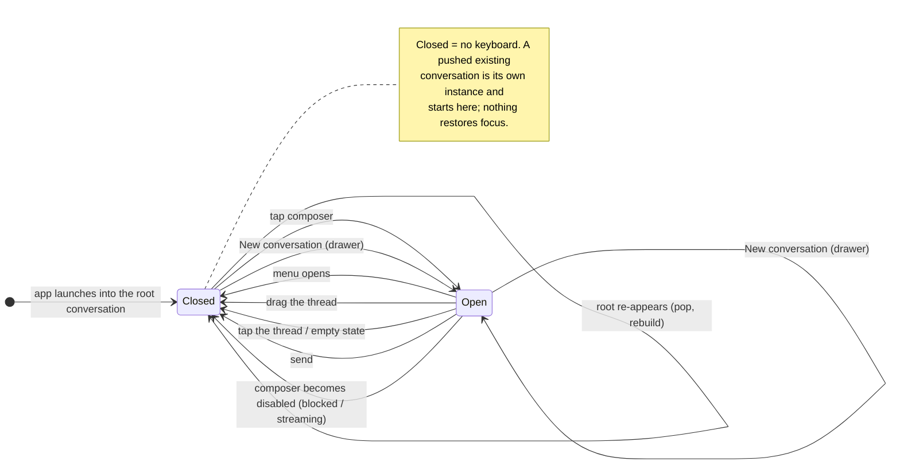

# RFC 127: A state model for composer focus and the keyboard

## Motivation

The iOS app opens straight into a fresh conversation, and `ConversationView`
focuses its composer `.onAppear` whenever `startsFresh` is true. That was
written for **New conversation** in the drawer, but the root chat is _also_ a
fresh conversation, so the rule fires on launch: the app opens with the keyboard
up over half the screen.

Three defects follow from it, and one from an omission:

1. **Launch raises the keyboard.** Nobody asked for a turn yet; the first thing
   a student sees is a keyboard covering the thread they have not read.
2. **The keyboard cannot be dismissed.** The composer is a vertical-axis
   `TextField`, so Return inserts a newline rather than resigning. There is no
   drag-to-dismiss on the thread and no tap-outside, so once focus is taken the
   only exit is sending a message.
3. **The drawer opens under the keyboard.** Opening the menu leaves the keyboard
   up, and **Settings** — the bottom row of the drawer — is behind it and
   unreachable.

The underlying cause is that focus is derived from _appearance_ (`onAppear` +
`startsFresh`) rather than from _intent_. Appearance happens on launch, on a
`.id()` rebuild, and on returning from a push; intent happens exactly when the
student asks for a blank page. This RFC replaces the derivation with an explicit
state model, and names every transition.

## Detailed Design

### The model

One piece of state, `isComposerFocused`, per `ConversationView`. Its value is
the keyboard: focused means the keyboard is up.



The canonical, **maintained** copy of this diagram is `ios-app/DESIGN.md` §7.1 —
this RFC is immutable, so a later change to the model edits the spec and says so
in a higher-numbered RFC, and the copy here stays as the record of what was
decided today.

The whole behaviour as a transition table. **App launch is not a transition** —
it is the initial state, and the initial state is CLOSED.

| Event                                          | From   | To     | Why                                                                                           |
| ---------------------------------------------- | ------ | ------ | --------------------------------------------------------------------------------------------- |
| App launches into the root conversation        | —      | CLOSED | Nothing was asked for. Read first, type when you choose.                                      |
| Root conversation re-appears (pop, rebuild)    | any    | CLOSED | Appearance is not intent; this is the bug being fixed.                                        |
| **New conversation** tapped in the drawer      | any    | OPEN   | The one explicit "give me a blank page and let me type" gesture.                              |
| A blank page pushed from the conversation list | any    | OPEN   | The compose button and **Start a conversation** are the same gesture, said on another screen. |
| Student taps the composer                      | CLOSED | OPEN   | System behaviour; nothing to implement.                                                       |
| Menu opens (button, from any keyboard state)   | any    | CLOSED | The drawer's own rows — Settings especially — must be reachable.                              |
| Menu closes (scrim, swipe, selection)          | CLOSED | CLOSED | Focus is **not** restored: closing a drawer is not a request to type.                         |
| Drag on the thread                             | OPEN   | CLOSED | `.scrollDismissesKeyboard(.interactively)` — the platform gesture.                            |
| Tap on the thread / empty state                | OPEN   | CLOSED | The only exit on a blank conversation, which has nothing to scroll.                           |
| Send tapped                                    | OPEN   | CLOSED | Unchanged: the turn is away, show the reply.                                                  |
| Composer becomes disabled (blocked/stream)     | OPEN   | CLOSED | A keyboard over a field that cannot accept a turn invites dead typing.                        |
| An existing conversation is pushed             | —      | CLOSED | Unchanged: history must not open under a keyboard.                                            |
| Settings / All conversations pushed            | any    | CLOSED | Follows from _menu opens_: those pushes are only reachable through it.                        |

Two notes on what is deliberately **absent**. There is no "restore focus on
return" — a stack of screens each remembering a keyboard is exactly the surprise
this RFC removes. And there is no scene-phase rule: backgrounding is not a state
change here, and returning to the foreground leaves the composer as the student
left it.

### Carrying intent into the view

`startsFresh` is deleted. It answered "is this a blank conversation?", which is
the wrong question — the root chat is blank at launch too.

Two replacements, one per direction:

**Opening.** The fresh-conversation initialiser takes
`focusesComposerOnAppear: Bool`. `AuthenticatedRootView` passes `false` on
launch and `true` only from **New conversation**, on a single `RootConversation`
value carrying the blank page's identity beside its intent — re-identifying the
root is what rebuilds it as a blank thread, and the two facts are one.

The intent is then **consumed once**, by `ConversationView` itself
(`hasConsumedInitialFocus`). Construction timing is not the guarantee it first
looks like: the root's value is never cleared, and `.onAppear` fires again on
every return, so a pop back from Settings would otherwise raise the keyboard on
a page asked for long before. The semantics wanted is _this_ blank page was
asked for, once — and only the view that owns the focus knows when the request
was spent.

**Closing from outside the view.** The root owns the drawer but not the focus
state, so it needs a channel. That is `ComposerFocus`, a tiny
`@MainActor ObservableObject` handed to the root's `ConversationView`:

```swift
@MainActor
final class ComposerFocus: ObservableObject {
    /// A distinct value per request, so two consecutive closes both land.
    @Published private(set) var closeRequest: UUID?

    func requestClose() { closeRequest = UUID() }
}
```

`ConversationView` mirrors it into its own `@FocusState`:

```swift
.onChange(of: focus?.closeRequest) { _, _ in isComposerFocused = false }
```

Only the **root** chat is given the object: the drawer exists only over the
root, so a pushed conversation has no close-from-outside path and is handed
`nil`. That keeps one command from addressing two composers, which a shared
`FocusState` binding down the stack would have done.

`setMenu(open:)` calls `requestClose()` whenever it opens the drawer, so every
route into the menu — the button, and therefore Settings and All conversations —
closes the keyboard first.

The alternative considered and rejected was the app-wide
`UIApplication.sendAction(#selector(UIResponder.resignFirstResponder) …)`
one-liner. It works, but it dismisses whatever is focused anywhere, leaves the
view's own `@FocusState` to be reconciled by UIKit, and states no model at all —
the thing this RFC exists to write down.

### Dismissal inside the view

- `.scrollDismissesKeyboard(.interactively)` on the thread `ScrollView`.
- A tap-to-dismiss over the thread area (`.contentShape(Rectangle())` +
  `.onTapGesture`), which is what makes the **empty** conversation — the exact
  screen the app launches on — dismissable at all.
- `.onChange(of: isComposerDisabled)` resigns focus when the composer turns off
  under a raised keyboard.

## Files Modified

- `ios-app/UnicoachiOS/ComposerFocus.swift` — **new**. The close-request channel
  described above.
- `ios-app/UnicoachiOS/ConversationView.swift` — drop `startsFresh`, add
  `focusesComposerOnAppear` and the optional `ComposerFocus`, consume the intent
  once; add the three dismissal rules (scroll, tap, disabled).
- `ios-app/UnicoachiOS/AuthenticatedRootView.swift` — own the `ComposerFocus`,
  carry the root blank page's identity and its "was requested" intent as one
  `RootConversation` value, and request a close in `setMenu(open:)`.
- `ios-app/UnicoachiOS/ConversationListView.swift` — the other caller of the
  fresh-conversation initialiser: its compose button and **Start a
  conversation** link push a blank page on request, so both pass
  `focusesComposerOnAppear: true`.
- `ios-app/DESIGN.md` — **new §7.1**, the maintained state diagram and
  transition table for composer focus, under Navigation where the drawer that
  drives half of it is already specified.
- `ios-app/UnicoachiOSTests/ComposerFocusTests.swift` — **new**. The unit tests
  and the hosted wiring tests.
- `ios-app/UnicoachiOSTests/SnapshotHost.swift` — the window-mounting recipe
  (`mount`, `dismiss`, the flushing `settle`) extracted out of `capture`, so the
  wiring tests mount through it instead of re-typing a recipe that had already
  drifted from it.
- `ios-app/UnicoachiOS.xcodeproj/project.pbxproj` — the two new files
  registered; this target has no file-system synchronization, so an unregistered
  file silently never compiles.

`ios-app/UnicoachiOSTests/SnapshotScenes.swift` is **not** touched: every scene
constructs an existing conversation, whose initialiser is source-compatible.

## Implementation Plan

1. Add `ComposerFocus`.
2. `ConversationView`: replace `startsFresh` with `focusesComposerOnAppear`,
   accept `focus: ComposerFocus?`, mirror `closeRequest` into `@FocusState`.
3. `ConversationView`: add scroll-, tap- and disabled-dismissal.
4. `AuthenticatedRootView`: `@StateObject ComposerFocus`, one `RootConversation`
   value (identity + intent) replaced by `startNewConversation()`,
   `requestClose()` in `setMenu(open:)`. The intent is consumed in
   `ConversationView`, not cleared here.
5. Fix up call sites (previews, snapshot scenes). 5b. Land the diagram in
   `DESIGN.md` §7.1, matching the code as built.
6. Unit tests; `bin/test`; snapshot the launch screen and the drawer.

## Tests

Unit (XCTest, `UnicoachiOSTests/ComposerFocusTests.swift`):

- `ComposerFocus` starts with no request; `requestClose()` publishes a value;
  two consecutive `requestClose()` calls publish **different** values (the
  regression guard for a drawer opened twice).

Wiring (same file, `ComposerFocusWiringTests`) — the real `ConversationView`
hosted in a live `UIWindow`, asserting on the **first responder**, which is what
the keyboard actually is. The unit tests above cannot fail for any of the
reported defects; these can:

- An **unrequested** blank page (`focusesComposerOnAppear: false`) leaves the
  first responder nil. This is the reported launch defect's guard.
- A **requested** blank page focuses the composer, so the gesture still works.
- A requested blank page that is left and returned to — drawer opened, Settings
  pushed, back — does **not** focus it again. The root's intent is never
  cleared, so this is the guard on consuming it exactly once.
- A `requestClose()` on the object the root owns lowers a raised keyboard —
  which is what `setMenu(open:)` does, and so what makes Settings reachable.
- The composer being blocked mid-thread (the shared meter refreshed to `spent`)
  lowers it too. Note this one asserts the behaviour, not the modifier:
  SwiftUI's `.disabled` resigns the field on its own, so
  `.onChange(of:
  isComposerDisabled)` is belt-and-braces over it.

**No snapshot scene.** An offscreen render host never raises a keyboard, so a
green "launch shows no keyboard" capture would prove nothing about the defect it
appeared to cover. The wiring tests are the gate; the eye on the device is the
confirmation. The existing scenes still act as the construction tripwire for the
changed initialiser.

Manual, on device/simulator — the three reported defects: launch shows no
keyboard; a raised keyboard can be dismissed by dragging or tapping the thread;
opening the drawer lowers it and Settings is tappable.
